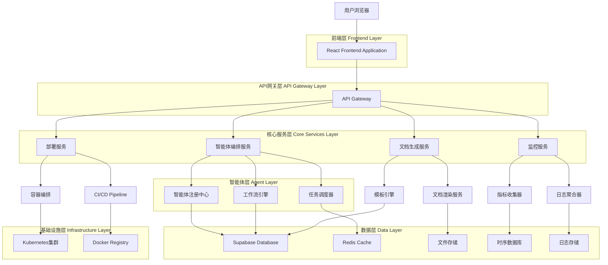
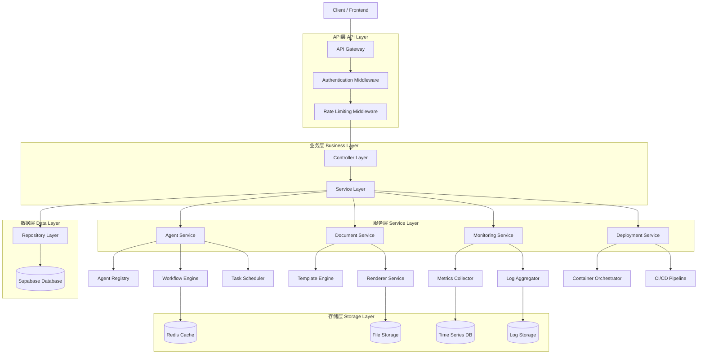
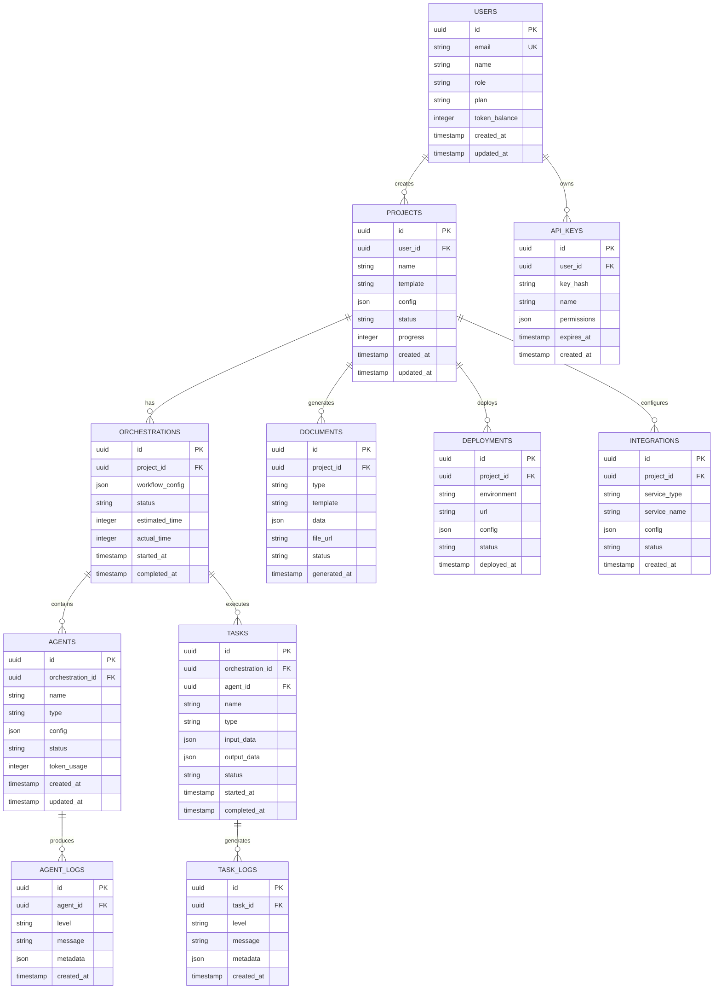

***

# YAML 前言区 | YAML Front-matter

meta:
identifier: "MAOS:MULTI-AGENT-ORCHESTRATION-ARCHITECTURE"
title: "多智能体编排调度中心平台技术架构文档|Multi-agent Orchestration Platform Technical Architecture"
moduleType: \["技术文档", "架构设计"]
domain: \["AI原生架构", "微服务", "云原生"]
version: "1.0.0"
status: \["设计中"]
owner: "{{AI架构师}}"
created: "2025-01-27"
updated: "2025-01-27"
relates\_to: \["../CORE/REQUIREMENTS.md", "multi-agent-orchestration-platform-prd.md", "../shared/fields/fields-s1in/"]

# 字段池引用配置

field\_pool\_config:
source\_file: "../shared/fields/fields-s1in/"
reference\_method: "external\_import"
auto\_sync: true
fallback\_mode: "local\_cache"

# 引用方式: {{dynamic\_fields.字段名}}

dynamic\_fields:
$ref: "../shared/fields/fields-s1in/core-p0.yaml#/fields"
$ref\_maos: "../shared/fields/fields-s1in/maos-p1.yaml#/fields"
---------------------------------------------------------------

# 多智能体编排调度中心平台技术架构文档

## 1. Architecture design



## 2. Technology Description

* Frontend: React\@18 + TypeScript + Tailwind CSS + Vite + Zustand

* Backend: Node.js\@20 + Express\@4 + TypeScript

* Database: Supabase (PostgreSQL) + Redis\@7

* Agent Framework: LangChain + OpenAI API + Custom Agent SDK

* Container: Docker + Kubernetes

* Monitoring: Prometheus + Grafana + ELK Stack

* CI/CD: GitHub Actions + Docker Registry

* File Storage: Supabase Storage + CDN

## 3. Route definitions

| Route              | Purpose            |
| ------------------ | ------------------ |
| /                  | 控制台首页，显示智能体状态和项目概览 |
| /login             | 用户登录页面，支持多种认证方式    |
| /dashboard         | 用户仪表板，个人项目管理中心     |
| /projects/create   | 项目创建页面，MVP配置向导     |
| /projects/:id      | 项目详情页面，进度监控和管理     |
| /agents            | 智能体编排页面，可视化工作流设计   |
| /agents/:id/config | 智能体配置页面，参数和权限设置    |
| /monitoring        | 实时监控页面，性能和日志查看     |
| /documents         | 文档生成页面，模板管理和导出     |
| /documents/:id     | 文档详情页面，预览和编辑       |
| /analytics         | 市场分析页面，竞品和趋势分析     |
| /finance           | 财务建模页面，成本和收入分析     |
| /deploy            | 部署管理页面，环境和域名配置     |
| /integrations      | 生态集成页面，API和插件管理    |
| /settings          | 用户设置页面，账户和偏好配置     |

## 4. API definitions

### 4.1 Core API

#### 智能体编排相关

```
POST /api/agents/orchestrate
```

Request:

| Param Name  | Param Type | isRequired | Description |
| ----------- | ---------- | ---------- | ----------- |
| projectId   | string     | true       | 项目唯一标识符     |
| agentConfig | object     | true       | 智能体配置信息     |
| workflow    | object     | true       | 工作流定义       |
| budget      | object     | false      | Token预算配置   |

Response:

| Param Name      | Param Type | Description |
| --------------- | ---------- | ----------- |
| orchestrationId | string     | 编排任务ID      |
| status          | string     | 编排状态        |
| estimatedTime   | number     | 预计完成时间(分钟)  |
| agents          | array      | 已分配的智能体列表   |

Example:

```json
{
  "projectId": "proj_123",
  "agentConfig": {
    "development": { "model": "gpt-4", "tokens": 2500 },
    "validation": { "model": "gpt-3.5-turbo", "tokens": 2000 }
  },
  "workflow": {
    "steps": ["discovery", "development", "validation", "deployment"]
  }
}
```

#### 项目管理相关

```
POST /api/projects
```

Request:

| Param Name | Param Type | isRequired | Description |
| ---------- | ---------- | ---------- | ----------- |
| name       | string     | true       | 项目名称        |
| template   | string     | true       | 模板类型        |
| config     | object     | true       | 项目配置        |
| userId     | string     | true       | 用户ID        |

Response:

| Param Name          | Param Type | Description |
| ------------------- | ---------- | ----------- |
| projectId           | string     | 项目唯一标识符     |
| status              | string     | 项目状态        |
| createdAt           | string     | 创建时间        |
| estimatedCompletion | string     | 预计完成时间      |

#### 文档生成相关

```
POST /api/documents/generate
```

Request:

| Param Name   | Param Type | isRequired | Description |
| ------------ | ---------- | ---------- | ----------- |
| projectId    | string     | true       | 项目ID        |
| documentType | string     | true       | 文档类型        |
| template     | string     | false      | 模板ID        |
| customFields | object     | false      | 自定义字段       |

Response:

| Param Name  | Param Type | Description |
| ----------- | ---------- | ----------- |
| documentId  | string     | 文档ID        |
| downloadUrl | string     | 下载链接        |
| status      | string     | 生成状态        |
| format      | string     | 文档格式        |

#### 监控相关

```
GET /api/monitoring/projects/:id/metrics
```

Response:

| Param Name  | Param Type | Description |
| ----------- | ---------- | ----------- |
| progress    | number     | 项目进度百分比     |
| performance | object     | 性能指标        |
| errors      | array      | 错误日志        |
| agents      | array      | 智能体状态       |

## 5. Server architecture diagram



## 6. Data model

### 6.1 Data model definition



### 6.2 Data Definition Language

#### 用户表 (users)

```sql
-- 创建用户表
CREATE TABLE users (
    id UUID PRIMARY KEY DEFAULT gen_random_uuid(),
    email VARCHAR(255) UNIQUE NOT NULL,
    name VARCHAR(100) NOT NULL,
    role VARCHAR(20) DEFAULT 'entrepreneur' CHECK (role IN ('entrepreneur', 'enterprise', 'developer', 'investor')),
    plan VARCHAR(20) DEFAULT 'free' CHECK (plan IN ('free', 'basic', 'pro', 'enterprise')),
    token_balance INTEGER DEFAULT 10000,
    created_at TIMESTAMP WITH TIME ZONE DEFAULT NOW(),
    updated_at TIMESTAMP WITH TIME ZONE DEFAULT NOW()
);

-- 创建索引
CREATE INDEX idx_users_email ON users(email);
CREATE INDEX idx_users_role ON users(role);
CREATE INDEX idx_users_created_at ON users(created_at DESC);

-- 权限设置
GRANT SELECT ON users TO anon;
GRANT ALL PRIVILEGES ON users TO authenticated;
```

#### 项目表 (projects)

```sql
-- 创建项目表
CREATE TABLE projects (
    id UUID PRIMARY KEY DEFAULT gen_random_uuid(),
    user_id UUID NOT NULL REFERENCES users(id) ON DELETE CASCADE,
    name VARCHAR(200) NOT NULL,
    template VARCHAR(50) NOT NULL,
    config JSONB NOT NULL DEFAULT '{}',
    status VARCHAR(20) DEFAULT 'created' CHECK (status IN ('created', 'configuring', 'orchestrating', 'developing', 'testing', 'deploying', 'deployed', 'failed')),
    progress INTEGER DEFAULT 0 CHECK (progress >= 0 AND progress <= 100),
    created_at TIMESTAMP WITH TIME ZONE DEFAULT NOW(),
    updated_at TIMESTAMP WITH TIME ZONE DEFAULT NOW()
);

-- 创建索引
CREATE INDEX idx_projects_user_id ON projects(user_id);
CREATE INDEX idx_projects_status ON projects(status);
CREATE INDEX idx_projects_created_at ON projects(created_at DESC);
CREATE INDEX idx_projects_template ON projects(template);

-- 权限设置
GRANT SELECT ON projects TO anon;
GRANT ALL PRIVILEGES ON projects TO authenticated;
```

#### 智能体编排表 (orchestrations)

```sql
-- 创建智能体编排表
CREATE TABLE orchestrations (
    id UUID PRIMARY KEY DEFAULT gen_random_uuid(),
    project_id UUID NOT NULL REFERENCES projects(id) ON DELETE CASCADE,
    workflow_config JSONB NOT NULL DEFAULT '{}',
    status VARCHAR(20) DEFAULT 'pending' CHECK (status IN ('pending', 'running', 'completed', 'failed', 'cancelled')),
    estimated_time INTEGER, -- 预计完成时间(分钟)
    actual_time INTEGER, -- 实际完成时间(分钟)
    started_at TIMESTAMP WITH TIME ZONE,
    completed_at TIMESTAMP WITH TIME ZONE,
    created_at TIMESTAMP WITH TIME ZONE DEFAULT NOW()
);

-- 创建索引
CREATE INDEX idx_orchestrations_project_id ON orchestrations(project_id);
CREATE INDEX idx_orchestrations_status ON orchestrations(status);
CREATE INDEX idx_orchestrations_started_at ON orchestrations(started_at DESC);

-- 权限设置
GRANT SELECT ON orchestrations TO anon;
GRANT ALL PRIVILEGES ON orchestrations TO authenticated;
```

#### 智能体表 (agents)

```sql
-- 创建智能体表
CREATE TABLE agents (
    id UUID PRIMARY KEY DEFAULT gen_random_uuid(),
    orchestration_id UUID NOT NULL REFERENCES orchestrations(id) ON DELETE CASCADE,
    name VARCHAR(100) NOT NULL,
    type VARCHAR(50) NOT NULL CHECK (type IN ('development', 'discovery', 'validation', 'monitoring', 'deployment', 'documentation')),
    config JSONB NOT NULL DEFAULT '{}',
    status VARCHAR(20) DEFAULT 'idle' CHECK (status IN ('idle', 'running', 'completed', 'failed', 'paused')),
    token_usage INTEGER DEFAULT 0,
    created_at TIMESTAMP WITH TIME ZONE DEFAULT NOW(),
    updated_at TIMESTAMP WITH TIME ZONE DEFAULT NOW()
);

-- 创建索引
CREATE INDEX idx_agents_orchestration_id ON agents(orchestration_id);
CREATE INDEX idx_agents_type ON agents(type);
CREATE INDEX idx_agents_status ON agents(status);
CREATE INDEX idx_agents_created_at ON agents(created_at DESC);

-- 权限设置
GRANT SELECT ON agents TO anon;
GRANT ALL PRIVILEGES ON agents TO authenticated;
```

#### 文档表 (documents)

```sql
-- 创建文档表
CREATE TABLE documents (
    id UUID PRIMARY KEY DEFAULT gen_random_uuid(),
    project_id UUID NOT NULL REFERENCES projects(id) ON DELETE CASCADE,
    type VARCHAR(50) NOT NULL CHECK (type IN ('business_plan', 'pitch_deck', 'market_research', 'financial_model', 'technical_doc', 'user_manual')),
    template VARCHAR(100),
    data JSONB NOT NULL DEFAULT '{}',
    file_url TEXT,
    status VARCHAR(20) DEFAULT 'pending' CHECK (status IN ('pending', 'generating', 'completed', 'failed')),
    generated_at TIMESTAMP WITH TIME ZONE DEFAULT NOW()
);

-- 创建索引
CREATE INDEX idx_documents_project_id ON documents(project_id);
CREATE INDEX idx_documents_type ON documents(type);
CREATE INDEX idx_documents_status ON documents(status);
CREATE INDEX idx_documents_generated_at ON documents(generated_at DESC);

-- 权限设置
GRANT SELECT ON documents TO anon;
GRANT ALL PRIVILEGES ON documents TO authenticated;
```

#### 初始化数据

```sql
-- 插入示例用户
INSERT INTO users (email, name, role, plan) VALUES
('demo@example.com', 'Demo User', 'entrepreneur', 'free'),
('enterprise@example.com', 'Enterprise User', 'enterprise', 'pro'),
('developer@example.com', 'Developer User', 'developer', 'basic');

-- 插入示例项目模板配置
INSERT INTO projects (user_id, name, template, config) 
SELECT 
    u.id,
    'Demo E-commerce Platform',
    'b2c_ecommerce',
    '{
        "business_type": "retail",
        "target_market": "consumer",
        "features": ["product_catalog", "shopping_cart", "payment", "user_management"],
        "budget": {
            "development": 2500,
            "validation": 2000,
            "deployment": 1000
        }
    }'::jsonb
FROM users u WHERE u.email = 'demo@example.com';
```

