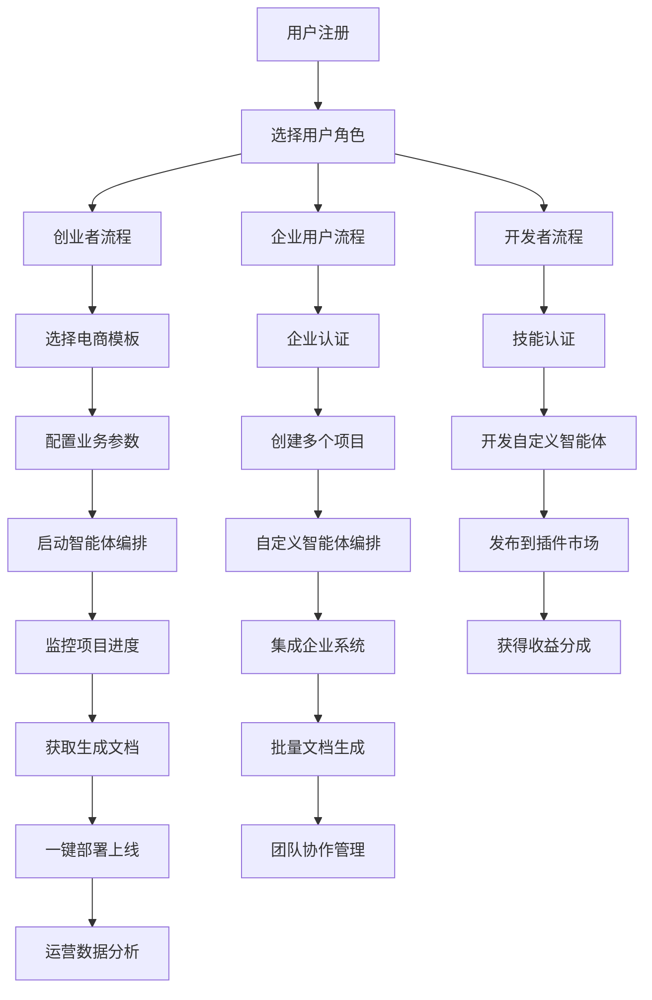

---
# YAML 前言区 | YAML Front-matter
meta:
  identifier: "MAOS:MULTI-AGENT-ORCHESTRATION-PLATFORM"
  title: "多智能体编排调度中心平台产品需求文档|Multi-agent Orchestration Control Center Platform PRD"
  moduleType: ["产品文档", "需求规范"]
  domain: ["AI原生平台", "多智能体系统", "MVP赋能"]
  version: "1.0.0"
  status: ["开发中"]
  owner: "{{产品负责人}}"
  created: "2025-01-27"
  updated: "2025-01-27"
  relates_to: ["../CORE/REQUIREMENTS.md", "../shared/fields/fields-s1in/", "multi-agent-orchestration-platform-architecture.md"]

# 字段池引用配置
field_pool_config:
  source_file: "../shared/fields/fields-s1in/"
  reference_method: "external_import"
  auto_sync: true
  fallback_mode: "local_cache"

# 引用方式: {{dynamic_fields.字段名}}
dynamic_fields:
  $ref: "../shared/fields/fields-s1in/core-p0.yaml#/fields"
  $ref_maos: "../shared/fields/fields-s1in/maos-p1.yaml#/fields"
---

# 多智能体编排调度中心平台产品需求文档

## 1. Product Overview

多智能体编排调度中心平台（MAOS Platform）是一个AI原生的智能体协作平台，专注于24小时内完成MVP电商平台的搭建、上线与运维。
平台通过智能体编排技术，实现从商业策划到技术实现的全流程自动化，同时提供实时文档生成、市场分析、财务建模等企业级服务。
目标市场价值：为创业者和中小企业提供零门槛的电商平台快速启动解决方案，预计节省90%的开发时间和80%的启动成本。

## 2. Core Features

### 2.1 User Roles

| Role | Registration Method | Core Permissions |
|------|---------------------|------------------|
| 创业者 | 邮箱注册 + 项目验证 | 创建MVP项目、使用基础智能体、查看基础报告 |
| 企业用户 | 企业认证 + 付费订阅 | 高级智能体编排、定制化文档生成、API集成 |
| 开发者 | GitHub集成 + 技能认证 | 智能体开发、模块扩展、生态集成 |
| 投资人 | 邀请码 + 身份验证 | 查看项目报告、市场分析、财务模型 |

### 2.2 Feature Module

我们的多智能体编排调度中心平台包含以下核心页面：

1. **控制台首页**: 智能体状态监控、项目概览、快速启动向导
2. **项目创建页**: MVP配置向导、模板选择、智能体编排设置
3. **智能体编排页**: 可视化编排界面、智能体配置、工作流设计
4. **实时监控页**: 项目进度跟踪、性能监控、日志查看
5. **文档生成页**: 自动化文档生成、模板管理、导出功能
6. **市场分析页**: 竞品分析、市场趋势、用户画像
7. **财务建模页**: 成本分析、收入预测、投资回报计算
8. **部署管理页**: 一键部署、环境管理、域名配置
9. **生态集成页**: API管理、第三方服务集成、插件市场

### 2.3 Page Details

| Page Name | Module Name | Feature description |
|-----------|-------------|---------------------|
| 控制台首页 | 智能体状态监控 | 实时显示所有智能体运行状态、资源使用情况、异常告警 |
| 控制台首页 | 项目概览 | 展示当前项目列表、进度状态、关键指标仪表板 |
| 控制台首页 | 快速启动向导 | 3步完成MVP项目创建：选择模板→配置参数→启动部署 |
| 项目创建页 | MVP配置向导 | 引导式配置：业务类型、目标市场、功能需求、预算设置 |
| 项目创建页 | 模板选择 | 预置电商模板：B2C商城、B2B平台、社交电商、直播带货 |
| 项目创建页 | 智能体编排设置 | 选择智能体组合：开发、运维、营销、客服、数据分析 |
| 智能体编排页 | 可视化编排界面 | 拖拽式智能体连接、工作流设计、依赖关系配置 |
| 智能体编排页 | 智能体配置 | 参数设置、权限管理、资源分配、执行策略 |
| 智能体编排页 | 工作流设计 | 任务分解、并行处理、异常处理、回滚机制 |
| 实时监控页 | 项目进度跟踪 | 里程碑进度、任务完成度、预计完成时间、风险预警 |
| 实时监控页 | 性能监控 | CPU/内存使用率、API响应时间、错误率统计 |
| 实时监控页 | 日志查看 | 实时日志流、错误日志过滤、操作审计记录 |
| 文档生成页 | 自动化文档生成 | 基于项目数据生成：商业计划书、技术文档、用户手册 |
| 文档生成页 | 模板管理 | 文档模板库、自定义模板、版本控制 |
| 文档生成页 | 导出功能 | 支持PDF、Word、PPT格式导出，品牌定制 |
| 市场分析页 | 竞品分析 | 自动抓取竞品信息、功能对比、定价策略分析 |
| 市场分析页 | 市场趋势 | 行业报告生成、趋势预测、机会识别 |
| 市场分析页 | 用户画像 | 目标用户分析、需求挖掘、营销建议 |
| 财务建模页 | 成本分析 | 开发成本、运营成本、营销成本自动计算 |
| 财务建模页 | 收入预测 | 基于市场数据的收入模型、增长预测 |
| 财务建模页 | 投资回报计算 | ROI分析、盈亏平衡点、融资需求评估 |
| 部署管理页 | 一键部署 | 自动化部署到云平台、环境配置、SSL证书 |
| 部署管理页 | 环境管理 | 开发/测试/生产环境切换、版本管理 |
| 部署管理页 | 域名配置 | 域名绑定、DNS配置、CDN加速设置 |
| 生态集成页 | API管理 | 第三方API集成、接口文档、调用监控 |
| 生态集成页 | 第三方服务集成 | 支付、物流、客服、营销工具集成 |
| 生态集成页 | 插件市场 | 功能插件浏览、安装、配置、更新管理 |

## 3. Core Process

### 创业者流程
用户注册登录 → 选择电商模板 → 配置业务参数 → 启动智能体编排 → 监控项目进度 → 获取生成文档 → 一键部署上线 → 运营数据分析

### 企业用户流程
企业认证 → 创建多个项目 → 自定义智能体编排 → 集成企业系统 → 批量文档生成 → 团队协作管理 → 高级分析报告

### 开发者流程
技能认证 → 开发自定义智能体 → 发布到插件市场 → 获得收益分成 → 维护更新插件

## 4. User Interface Design

### 4.1 Design Style

- **主色调**: 科技蓝 #2563EB，辅助色：成功绿 #10B981，警告橙 #F59E0B
- **按钮样式**: 圆角按钮，渐变效果，悬停动画
- **字体**: 主字体 Inter，中文字体 PingFang SC，代码字体 JetBrains Mono
- **布局风格**: 卡片式设计，左侧导航，响应式网格布局
- **图标风格**: 线性图标配合实心图标，统一使用 Heroicons
- **动画效果**: 微交互动画，加载动画，状态转换动画

### 4.2 Page Design Overview

| Page Name | Module Name | UI Elements |
|-----------|-------------|-------------|
| 控制台首页 | 智能体状态监控 | 实时状态卡片，绿色/红色状态指示器，环形进度图，Tailwind CSS grid布局 |
| 控制台首页 | 项目概览 | 项目卡片网格，进度条，数据可视化图表，悬停效果 |
| 控制台首页 | 快速启动向导 | 步骤指示器，大按钮设计，引导箭头，渐变背景 |
| 智能体编排页 | 可视化编排界面 | 拖拽画布，连接线动画，节点高亮，工具栏浮动 |
| 智能体编排页 | 智能体配置 | 表单面板，滑动开关，数值输入器，配置预览 |
| 实时监控页 | 项目进度跟踪 | 时间轴组件，里程碑标记，进度环，状态徽章 |
| 实时监控页 | 性能监控 | 实时图表，仪表盘，告警通知，数据表格 |
| 文档生成页 | 自动化文档生成 | 文档预览，生成按钮，进度指示，下载链接 |
| 市场分析页 | 竞品分析 | 对比表格，雷达图，趋势图，数据卡片 |
| 财务建模页 | 成本分析 | 饼图，柱状图，计算器界面，结果展示 |
| 部署管理页 | 一键部署 | 部署按钮，状态指示，日志窗口，配置面板 |
| 生态集成页 | API管理 | API列表，状态监控，文档链接，测试工具 |

### 4.3 Responsiveness

平台采用移动优先的响应式设计，支持桌面端、平板端和移动端访问。桌面端提供完整功能体验，移动端优化核心监控和管理功能，支持触摸手势操作和离线数据缓存。