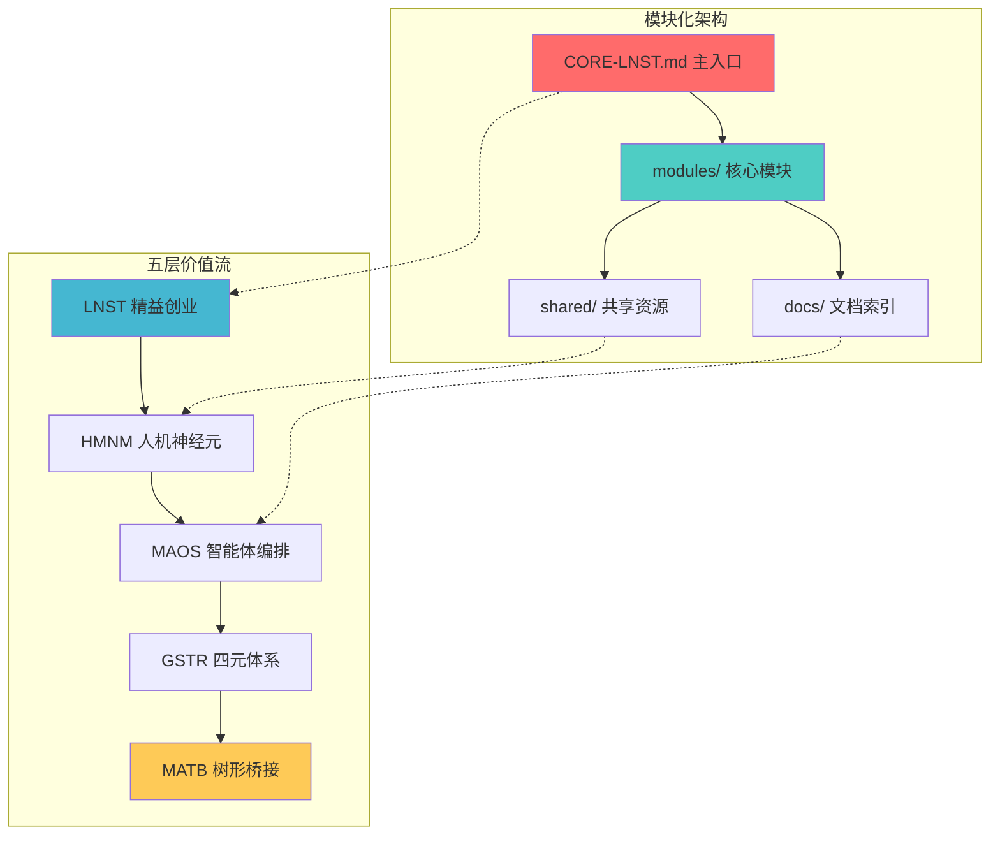

# 精益创业中枢 | Lean Startup Core

---
# YAML 前言区 | YAML Front-matter
meta:
  identifier: "CORE:CORE-LNST"
  title: "精益创业统筹中枢|Lean Startup Central Hub"
  moduleType: ["核心", "方法论"]
  domain: ["精益创业", "统筹中枢", "方法论"]
  version: "1.0.0"
  status: ["活跃维护"]
  owner: "{{系统架构师}}"
  created: "2025-08-07"
  updated: "2025-08-07"
  relates_to: ["modules/", "../fields/fields-s3out/fields.yaml"]

# 字段池引用配置
field_pool_config:
  source_file: "../fields/fields-s3out/fields.yaml"
  reference_method: "external_import"
  auto_sync: true
  fallback_mode: "local_cache"

# 引用方式: {{dynamic_fields.字段名}}
dynamic_fields:
  $ref: "../fields/fields-s3out/fields.yaml#/dynamic_fields"
---

# {{meta.title}}

## 概览

本文档是精益创业统筹中枢的主入口，采用模块化架构设计，整合了五大核心层级：

- **LNST**: 精益创业核心层
- **HMNM**: 人机神经元体系层  
- **MAOS**: 智能体编排系统层
- **GSTR**: 四元体系层
- **MATB**: 树形桥接层

## 模块导航

### 核心模块
- 📋 [LNST 精益创业核心层](./modules/01-LNST/) - 构建-测量-学习循环，五阶段价值链
- 🧠 [HMNM 人机神经元体系层](./modules/02-HMNM/) - 七份核心文档，神经流优化
- 🤖 [MAOS 智能体编排系统层](./modules/03-MAOS/) - 六类智能体，自适应编排
- 🎯 [GSTR 四元体系层](./modules/04-GSTR/) - 目标-空间-时间-资源框架
- 🌉 [MATB 树形桥接层](./modules/05-MATB/) - 格式转换，语义映射

### 集成与实施
- 🔗 [集成优化](./modules/06-Integration/) - 五层价值流集成，Token经济性
- 🚀 [实施指南](./modules/07-Implementation/) - 部署路径，监控优化
- 📚 [参考资料](./modules/08-Reference/) - 术语词典，模板库

### 文档索引
- 📖 [模块索引](./docs/module-index.md) - 完整模块列表和依赖关系
- 🔧 [集成指南](./docs/integration-guide.md) - 模块集成和使用指南

## 快速开始

### 🚀 24小时MVP流程
1. **阅读概览** → [模块索引](./docs/module-index.md)
2. **选择阶段** → [LNST阶段模块](./modules/01-LNST/)
3. **配置系统** → [集成指南](./docs/integration-guide.md)
4. **执行上线** → [24小时MVP流程](./modules/06-Integration/Integration-MVPFlow.md)

### 🎯 按场景使用

| 使用场景 | 推荐模块组合 | 快速入口 |
|----------|-------------|----------|
| **快速MVP** | LNST + HMNM + Integration | [MVP流程](./modules/06-Integration/Integration-MVPFlow.md) |
| **智能体开发** | MAOS + MATB + Reference | [智能体架构](./modules/03-MAOS/MAOS-Architecture.md) |
| **战略规划** | LNST + GSTR + Implementation | [战略框架](./modules/04-GSTR/GSTR-Framework.md) |
| **投资人展示** | LNST + Integration + Reference | [投资人就绪度](./modules/01-LNST/LNST-InvestorReadiness.md) |

## 核心价值主张

| 价值层级 | 核心组件 | 主要功能 | 创业价值 |
|----------|----------|----------|----------|
| **LNST精益创业** | 构建-测量-学习 | 假设验证、快速迭代、投资人就绪 | 创业成功率≥70% |
| **HMNM人机神经元** | 核心文档 | 神经网络式协作、MVP | MVP上线效率3x |
| **MAOS智能体编排** | 核心智能体 | 多智能体协作、自适应编排 | 自动化协作≥90% |
| **GSTR四元体系** | 目标-资源-空间-时间 | 战略执行对齐、OODA循环 | 执行成功率≥85% |
| **MATB树形桥接** | 格式转换引擎 | 人机语言桥接、可视化 | 沟通效率≥85% |

## 架构概览

## 版本信息

- **当前版本**: v2.0.0 (模块化重构)
- **上一版本**: v1.0.0 (单体文档)
- **重构日期**: 2025-08-07
- **兼容性**: 向后兼容，支持渐进迁移

---

> 💡 **提示**: 这是模块化重构后的新版本。如需查看完整的原始文档，请参考 `CORE-LNST-LEGACY.md`