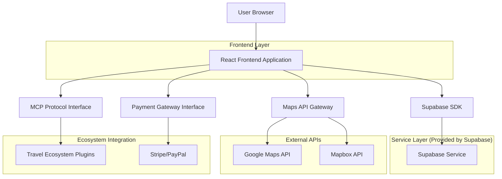
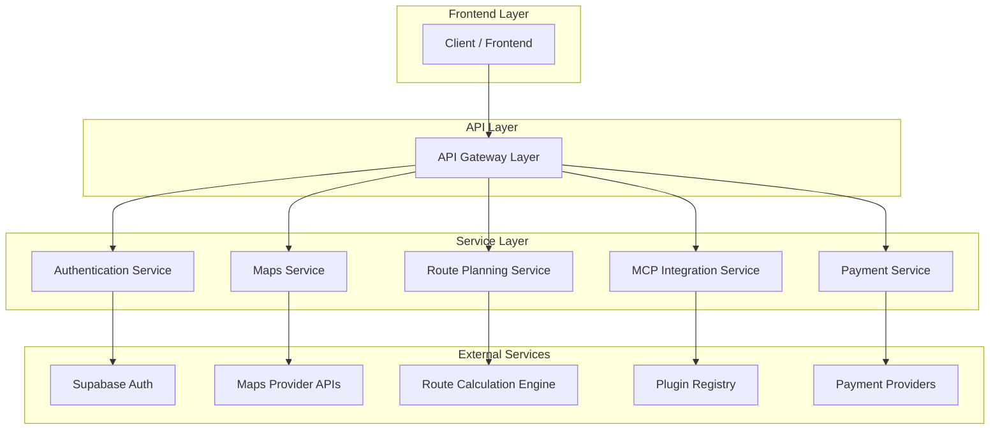
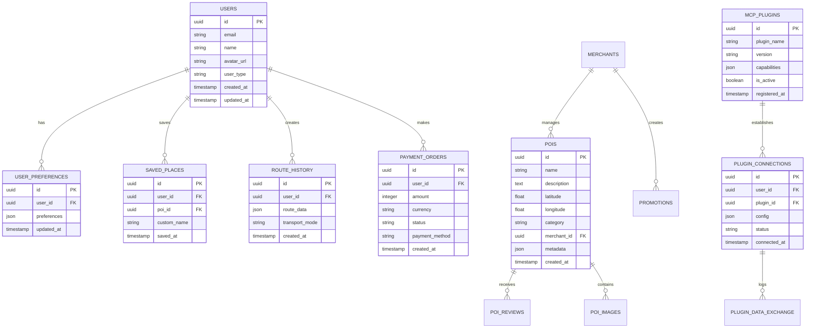

***

# YAML 前言区 | YAML Front-matter

meta:
identifier: "MAPS-EXPLORER:ARCHITECTURE"
title: "航空与旅游地图导览技术架构文档|Maps Explorer Technical Architecture"
moduleType: \["技术", "架构"]
domain: \["系统设计", "接口规范", "扩展架构"]
version: "1.0.0"
status: \["草案"]
owner: "{{AI架构师}}"
created: "2025-01-27"
updated: "2025-01-27"
relates\_to: \["../CORE/REQUIREMENTS.md", "maps-explorer-prd.md"]

# 字段池引用配置

field\_pool\_config:
source\_file: "../shared/fields/fields-s3out/fields.yaml"
reference\_method: "external\_import"
auto\_sync: true
fallback\_mode: "local\_cache"

# 引用方式: {{dynamic\_fields.字段名}}

dynamic\_fields:
$ref: "../shared/fields/fields-s3out/fields.yaml#/dynamic\_fields"
------------------------------------------------------------------

# 航空与旅游地图导览技术架构文档|Maps Explorer Technical Architecture

## 1. Architecture Design



## 2. Technology Description

* Frontend: React\@18 + TypeScript + Tailwind CSS\@3 + Vite

* Backend: Supabase (Authentication, Database, Storage)

* Maps: Google Maps API + Mapbox GL JS

* State Management: Zustand

* UI Components: Radix UI + Shadcn/ui

* Build Tool: Vite

* Deployment: Vercel

## 3. Route Definitions

| Route           | Purpose             |
| --------------- | ------------------- |
| /               | 首页，显示智能推荐和快速搜索功能    |
| /map            | 地图页面，提供交互式地图和POI标注  |
| /route-planning | 路线规划页面，智能路线生成和多模式交通 |
| /profile        | 个人中心，用户资料和收藏管理      |
| /merchant       | 商户管理页面，内容发布和数据分析    |
| /auth/login     | 登录页面，支持多种登录方式       |
| /auth/register  | 注册页面，用户注册流程         |
| /search         | 搜索结果页面，显示搜索结果和筛选    |
| /poi/:id        | POI详情页面，显示兴趣点详细信息   |
| /settings       | 设置页面，应用配置和偏好设置      |

## 4. API Definitions

### 4.1 Core API

**用户认证相关**

```
POST /api/auth/login
```

Request:

| Param Name | Param Type | isRequired | Description |
| ---------- | ---------- | ---------- | ----------- |
| email      | string     | true       | 用户邮箱地址      |
| password   | string     | true       | 用户密码        |

Response:

| Param Name | Param Type | Description |
| ---------- | ---------- | ----------- |
| success    | boolean    | 登录是否成功      |
| user       | object     | 用户信息对象      |
| token      | string     | 访问令牌        |

Example:

```json
{
  "email": "user@example.com",
  "password": "securepassword123"
}
```

**地图数据相关**

```
GET /api/maps/poi
```

Request:

| Param Name | Param Type | isRequired | Description |
| ---------- | ---------- | ---------- | ----------- |
| lat        | number     | true       | 纬度坐标        |
| lng        | number     | true       | 经度坐标        |
| radius     | number     | false      | 搜索半径(米)     |
| category   | string     | false      | POI分类筛选     |

Response:

| Param Name | Param Type | Description |
| ---------- | ---------- | ----------- |
| pois       | array      | POI数据列表     |
| total      | number     | 总数量         |

**路线规划相关**

```
POST /api/route/plan
```

Request:

| Param Name  | Param Type | isRequired | Description |
| ----------- | ---------- | ---------- | ----------- |
| origin      | object     | true       | 起点坐标        |
| destination | object     | true       | 终点坐标        |
| waypoints   | array      | false      | 途经点列表       |
| mode        | string     | true       | 交通方式        |

Response:

| Param Name | Param Type | Description |
| ---------- | ---------- | ----------- |
| route      | object     | 路线详情        |
| duration   | number     | 预计时长(秒)     |
| distance   | number     | 距离(米)       |

### 4.2 MCP Protocol Interface

**MCP连接管理**

```
POST /api/mcp/connect
```

Request:

| Param Name | Param Type | isRequired | Description |
| ---------- | ---------- | ---------- | ----------- |
| plugin\_id | string     | true       | 插件标识符       |
| config     | object     | true       | 插件配置参数      |

Response:

| Param Name     | Param Type | Description |
| -------------- | ---------- | ----------- |
| connection\_id | string     | 连接标识符       |
| status         | string     | 连接状态        |

**插件数据交换**

```
POST /api/mcp/exchange
```

Request:

| Param Name     | Param Type | isRequired | Description |
| -------------- | ---------- | ---------- | ----------- |
| connection\_id | string     | true       | 连接标识符       |
| action         | string     | true       | 操作类型        |
| payload        | object     | true       | 数据载荷        |

Response:

| Param Name | Param Type | Description |
| ---------- | ---------- | ----------- |
| result     | object     | 操作结果        |
| status     | string     | 执行状态        |

### 4.3 Payment Gateway Interface

**支付订单创建**

```
POST /api/payment/create-order
```

Request:

| Param Name  | Param Type | isRequired | Description |
| ----------- | ---------- | ---------- | ----------- |
| amount      | number     | true       | 支付金额(分)     |
| currency    | string     | true       | 货币类型        |
| description | string     | true       | 订单描述        |
| user\_id    | string     | true       | 用户ID        |

Response:

| Param Name   | Param Type | Description |
| ------------ | ---------- | ----------- |
| order\_id    | string     | 订单标识符       |
| payment\_url | string     | 支付链接        |
| expires\_at  | string     | 过期时间        |

## 5. Server Architecture Diagram



## 6. Data Model

### 6.1 Data Model Definition



### 6.2 Data Definition Language

**用户表 (users)**

```sql
-- 创建用户表
CREATE TABLE users (
    id UUID PRIMARY KEY DEFAULT gen_random_uuid(),
    email VARCHAR(255) UNIQUE NOT NULL,
    name VARCHAR(100) NOT NULL,
    avatar_url TEXT,
    user_type VARCHAR(20) DEFAULT 'tourist' CHECK (user_type IN ('tourist', 'premium', 'merchant')),
    created_at TIMESTAMP WITH TIME ZONE DEFAULT NOW(),
    updated_at TIMESTAMP WITH TIME ZONE DEFAULT NOW()
);

-- 创建索引
CREATE INDEX idx_users_email ON users(email);
CREATE INDEX idx_users_user_type ON users(user_type);

-- 设置权限
GRANT SELECT ON users TO anon;
GRANT ALL PRIVILEGES ON users TO authenticated;
```

**POI表 (pois)**

```sql
-- 创建POI表
CREATE TABLE pois (
    id UUID PRIMARY KEY DEFAULT gen_random_uuid(),
    name VARCHAR(200) NOT NULL,
    description TEXT,
    latitude DECIMAL(10, 8) NOT NULL,
    longitude DECIMAL(11, 8) NOT NULL,
    category VARCHAR(50) NOT NULL,
    merchant_id UUID REFERENCES users(id),
    metadata JSONB DEFAULT '{}',
    is_active BOOLEAN DEFAULT true,
    created_at TIMESTAMP WITH TIME ZONE DEFAULT NOW(),
    updated_at TIMESTAMP WITH TIME ZONE DEFAULT NOW()
);

-- 创建地理索引
CREATE INDEX idx_pois_location ON pois USING GIST (point(longitude, latitude));
CREATE INDEX idx_pois_category ON pois(category);
CREATE INDEX idx_pois_merchant ON pois(merchant_id);

-- 设置权限
GRANT SELECT ON pois TO anon;
GRANT ALL PRIVILEGES ON pois TO authenticated;
```

**MCP插件表 (mcp\_plugins)**

```sql
-- 创建MCP插件表
CREATE TABLE mcp_plugins (
    id UUID PRIMARY KEY DEFAULT gen_random_uuid(),
    plugin_name VARCHAR(100) UNIQUE NOT NULL,
    version VARCHAR(20) NOT NULL,
    capabilities JSONB NOT NULL DEFAULT '{}',
    is_active BOOLEAN DEFAULT true,
    registered_at TIMESTAMP WITH TIME ZONE DEFAULT NOW()
);

-- 创建索引
CREATE INDEX idx_mcp_plugins_name ON mcp_plugins(plugin_name);
CREATE INDEX idx_mcp_plugins_active ON mcp_plugins(is_active);

-- 设置权限
GRANT SELECT ON mcp_plugins TO anon;
GRANT ALL PRIVILEGES ON mcp_plugins TO authenticated;
```

**插件连接表 (plugin\_connections)**

```sql
-- 创建插件连接表
CREATE TABLE plugin_connections (
    id UUID PRIMARY KEY DEFAULT gen_random_uuid(),
    user_id UUID NOT NULL REFERENCES users(id) ON DELETE CASCADE,
    plugin_id UUID NOT NULL REFERENCES mcp_plugins(id) ON DELETE CASCADE,
    config JSONB DEFAULT '{}',
    status VARCHAR(20) DEFAULT 'active' CHECK (status IN ('active', 'inactive', 'error')),
    connected_at TIMESTAMP WITH TIME ZONE DEFAULT NOW(),
    last_used_at TIMESTAMP WITH TIME ZONE
);

-- 创建索引
CREATE INDEX idx_plugin_connections_user ON plugin_connections(user_id);
CREATE INDEX idx_plugin_connections_plugin ON plugin_connections(plugin_id);
CREATE INDEX idx_plugin_connections_status ON plugin_connections(status);

-- 设置权限
GRANT SELECT ON plugin_connections TO anon;
GRANT ALL PRIVILEGES ON plugin_connections TO authenticated;
```

**支付订单表 (payment\_orders)**

```sql
-- 创建支付订单表
CREATE TABLE payment_orders (
    id UUID PRIMARY KEY DEFAULT gen_random_uuid(),
    user_id UUID NOT NULL REFERENCES users(id) ON DELETE CASCADE,
    amount INTEGER NOT NULL CHECK (amount > 0),
    currency VARCHAR(3) DEFAULT 'USD',
    status VARCHAR(20) DEFAULT 'pending' CHECK (status IN ('pending', 'completed', 'failed', 'cancelled')),
    payment_method VARCHAR(50),
    external_order_id VARCHAR(100),
    metadata JSONB DEFAULT '{}',
    created_at TIMESTAMP WITH TIME ZONE DEFAULT NOW(),
    completed_at TIMESTAMP WITH TIME ZONE
);

-- 创建索引
CREATE INDEX idx_payment_orders_user ON payment_orders(user_id);
CREATE INDEX idx_payment_orders_status ON payment_orders(status);
CREATE INDEX idx_payment_orders_created ON payment_orders(created_at DESC);

-- 设置权限
GRANT SELECT ON payment_orders TO anon;
GRANT ALL PRIVILEGES ON payment_orders TO authenticated;
```

**初始化数据**

```sql
-- 插入示例MCP插件
INSERT INTO mcp_plugins (plugin_name, version, capabilities) VALUES
('flight-booking', '1.0.0', '{"actions": ["search_flights", "book_flight"], "data_types": ["flight_info", "booking_data"]}'),
('hotel-booking', '1.0.0', '{"actions": ["search_hotels", "book_hotel"], "data_types": ["hotel_info", "reservation_data"]}'),
('weather-service', '1.0.0', '{"actions": ["get_weather", "get_forecast"], "data_types": ["weather_data", "forecast_data"]}'),
('currency-exchange', '1.0.0', '{"actions": ["get_rates", "convert_currency"], "data_types": ["exchange_rates", "conversion_data"]}');

-- 插入示例POI分类
INSERT INTO pois (name, description, latitude, longitude, category, metadata) VALUES
('北京首都国际机场', '中国主要国际机场之一', 40.0799, 116.6031, 'airport', '{"iata_code": "PEK", "terminals": 3}'),
('上海浦东国际机场', '上海主要国际机场', 31.1443, 121.8083, 'airport', '{"iata_code": "PVG", "terminals": 2}'),
('故宫博物院', '明清两代皇宫，世界文化遗产', 39.9163, 116.3972, 'attraction', '{"ticket_price": 60, "opening_hours": "08:30-17:00"}'),
('外滩', '上海著名观光景点', 31.2396, 121.4906, 'attraction', '{"best_view_time": "sunset", "nearby_metro": "East Nanjing Road"}}');
```

