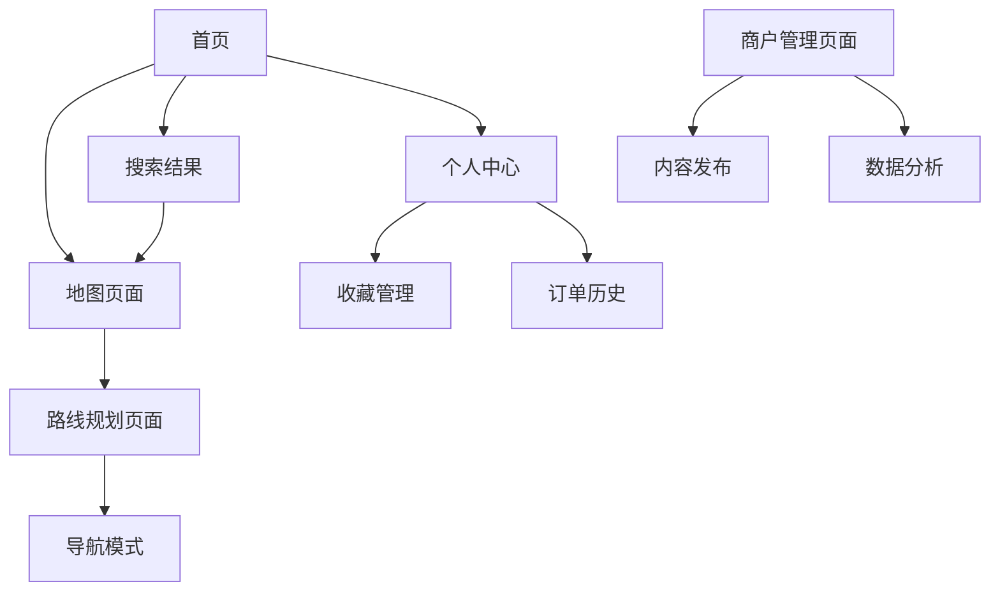

---
# YAML 前言区 | YAML Front-matter
meta:
  identifier: "MAPS-EXPLORER:PRD"
  title: "航空与旅游地图导览产品需求文档|Maps Explorer Product Requirements"
  moduleType: ["产品", "需求"]
  domain: ["航空旅游", "地图导览", "生态连接"]
  version: "1.0.0"
  status: ["草案"]
  owner: "{{产品负责人}}"
  created: "2025-01-27"
  updated: "2025-01-27"
  relates_to: ["../CORE/REQUIREMENTS.md", "maps-explorer-architecture.md"]

# 字段池引用配置
field_pool_config:
  source_file: "../shared/fields/fields-s3out/fields.yaml"
  reference_method: "external_import"
  auto_sync: true
  fallback_mode: "local_cache"

# 引用方式: {{dynamic_fields.字段名}}
dynamic_fields:
  $ref: "../shared/fields/fields-s3out/fields.yaml#/dynamic_fields"
---

# 航空与旅游地图导览产品需求文档|Maps Explorer PRD

## 1. Product Overview

航空与旅游地图导览（Maps Explorer）是一个AI原生的智能地图导览平台，专注于航空旅游场景的个性化路线规划和实时导览服务。

产品解决旅行者在陌生目的地缺乏本地化导览信息的痛点，通过智能推荐和实时导航提供无缝的旅游体验。目标成为航旅生态圈的核心连接平台，支持MCP协议和第三方支付系统集成。

## 2. Core Features

### 2.1 User Roles

| Role | Registration Method | Core Permissions |
|------|---------------------|------------------|
| 游客用户 | 邮箱注册或社交登录 | 浏览地图、基础导览、收藏地点 |
| 高级用户 | 付费升级 | 个性化路线、离线地图、专属客服 |
| 商户用户 | 商户认证 | 发布景点信息、管理优惠活动 |

### 2.2 Feature Module

我们的地图导览应用包含以下核心页面：
1. **首页**: 智能推荐、快速搜索、热门目的地展示
2. **地图页面**: 交互式地图、实时导航、POI标注
3. **路线规划页面**: 智能路线生成、多模式交通、时间优化
4. **个人中心**: 用户资料、收藏管理、订单历史
5. **商户管理页面**: 景点信息发布、数据分析、客户管理

### 2.3 Page Details

| Page Name | Module Name | Feature description |
|-----------|-------------|---------------------|
| 首页 | 智能推荐引擎 | 基于用户偏好和位置的个性化目的地推荐，热门景点轮播展示 |
| 首页 | 快速搜索 | 支持语音输入、智能联想、多语言搜索功能 |
| 地图页面 | 交互式地图 | 支持缩放、拖拽、图层切换，集成多家地图服务商API |
| 地图页面 | 实时导航 | GPS定位、语音导航、路况信息、到达时间预估 |
| 地图页面 | POI标注系统 | 景点、餐厅、酒店等兴趣点标注，支持用户自定义标记 |
| 路线规划页面 | 智能路线生成 | AI算法优化路线，考虑交通、时间、费用、偏好等因素 |
| 路线规划页面 | 多模式交通 | 支持步行、公交、地铁、出租车、共享单车等交通方式 |
| 个人中心 | 用户资料管理 | 个人信息编辑、偏好设置、隐私控制 |
| 个人中心 | 收藏管理 | 收藏地点、路线、攻略的统一管理和分类 |
| 商户管理页面 | 内容发布系统 | 景点信息发布、图片上传、营业时间管理 |
| 商户管理页面 | 数据分析面板 | 访问量统计、用户画像分析、收益报表 |

## 3. Core Process

**游客用户流程**：
用户打开应用 → 位置授权 → 浏览推荐内容 → 搜索目的地 → 查看地图详情 → 规划路线 → 开始导航 → 到达目的地 → 评价分享

**商户用户流程**：
商户注册 → 身份认证 → 发布景点信息 → 设置优惠活动 → 查看数据分析 → 客户互动管理

## 4. User Interface Design

### 4.1 Design Style

- **主色调**: 天空蓝(#2196F3)和旅游橙(#FF9800)
- **辅助色**: 白色(#FFFFFF)、浅灰(#F5F5F5)、深灰(#424242)
- **按钮样式**: 圆角矩形，轻微阴影效果，支持触觉反馈
- **字体**: 中文使用苹方/思源黑体，英文使用Roboto，主要字号16px/14px
- **布局风格**: 卡片式设计，底部导航栏，顶部搜索栏
- **图标风格**: 线性图标配合填充图标，统一视觉语言

### 4.2 Page Design Overview

| Page Name | Module Name | UI Elements |
|-----------|-------------|-------------|
| 首页 | 智能推荐引擎 | 轮播卡片，渐变背景，圆形头像，标签云展示 |
| 首页 | 快速搜索 | 圆角搜索框，语音按钮，历史搜索标签 |
| 地图页面 | 交互式地图 | 全屏地图视图，浮动控制按钮，底部信息卡片 |
| 地图页面 | POI标注系统 | 自定义图标标记，信息气泡，分类筛选器 |
| 路线规划页面 | 智能路线生成 | 时间轴布局，交通方式图标，费用对比表格 |
| 个人中心 | 用户资料管理 | 头像上传区域，表单输入框，开关控件 |

### 4.3 Responsiveness

产品采用移动优先设计，主要面向手机端用户，同时适配平板和桌面端。支持触摸手势操作，包括双指缩放、滑动切换等交互方式。