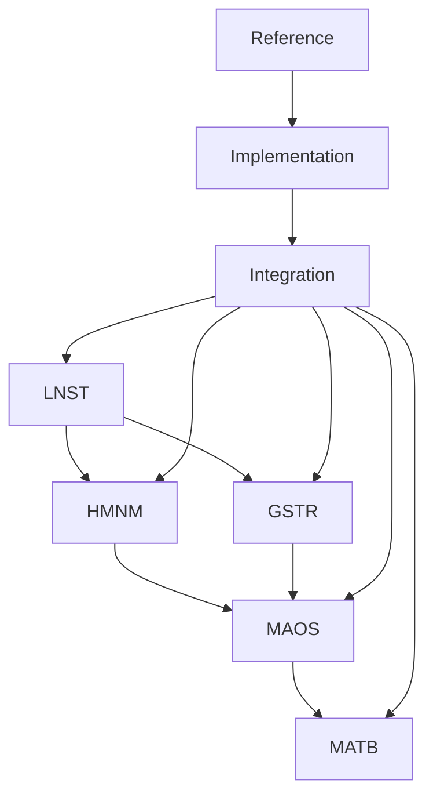

# 模块索引

## 核心模块

### 01-LNST 精益创业核心层
- [LNST-Overview.md](../modules/01-LNST/LNST-Overview.md) - 精益创业概览
- [LNST-Methodology.md](../modules/01-LNST/LNST-Methodology.md) - 方法论与循环
- [LNST-Phases.md](../modules/01-LNST/LNST-Phases.md) - 五阶段价值链
- [LNST-InvestorReadiness.md](../modules/01-LNST/LNST-InvestorReadiness.md) - 投资人就绪度框架

### 02-HMNM 人机神经元体系层
- [HMNM-Architecture.md](../modules/02-HMNM/HMNM-Architecture.md) - 神经网络文档体系
- [HMNM-Documents.md](../modules/02-HMNM/HMNM-Documents.md) - 七份核心文档
- [HMNM-NeuralFlow.md](../modules/02-HMNM/HMNM-NeuralFlow.md) - 神经流优化
- [HMNM-Collaboration.md](../modules/02-HMNM/HMNM-Collaboration.md) - 人机协作回路

### 03-MAOS 智能体编排系统层
- [MAOS-Architecture.md](../modules/03-MAOS/MAOS-Architecture.md) - 多智能体架构
- [MAOS-Agents.md](../modules/03-MAOS/MAOS-Agents.md) - 六类核心智能体
- [MAOS-Orchestration.md](../modules/03-MAOS/MAOS-Orchestration.md) - 编排机制
- [MAOS-StartupIntegration.md](../modules/03-MAOS/MAOS-StartupIntegration.md) - 精益创业集成

### 04-GSTR 四元体系层
- [GSTR-Framework.md](../modules/04-GSTR/GSTR-Framework.md) - 四元融合体系
- [GSTR-Dimensions.md](../modules/04-GSTR/GSTR-Dimensions.md) - 四维度架构
- [GSTR-OODA.md](../modules/04-GSTR/GSTR-OODA.md) - OODA循环适配
- [GSTR-Integration.md](../modules/04-GSTR/GSTR-Integration.md) - MAOS集成优化

### 05-MATB 树形桥接层
- [MATB-ConversionEngine.md](../modules/05-MATB/MATB-ConversionEngine.md) - 转换引擎
- [MATB-SemanticMapping.md](../modules/05-MATB/MATB-SemanticMapping.md) - 语义映射
- [MATB-AgentSyntax.md](../modules/05-MATB/MATB-AgentSyntax.md) - 智能体语法
- [MATB-Visualization.md](../modules/05-MATB/MATB-Visualization.md) - 可视化输出

## 集成与实施

### 06-Integration 集成优化
- [Integration-ValueFlow.md](../modules/06-Integration/Integration-ValueFlow.md) - 五层价值流集成
- [Integration-TokenEconomy.md](../modules/06-Integration/Integration-TokenEconomy.md) - Token经济性优化
- [Integration-MVPFlow.md](../modules/06-Integration/Integration-MVPFlow.md) - 24小时MVP流程
- [Integration-Assessment.md](../modules/06-Integration/Integration-Assessment.md) - 投资人就绪度评估

### 07-Implementation 实施指南
- [Implementation-Deployment.md](../modules/07-Implementation/Implementation-Deployment.md) - 部署实施路径
- [Implementation-Monitoring.md](../modules/07-Implementation/Implementation-Monitoring.md) - 监控与优化
- [Implementation-RiskControl.md](../modules/07-Implementation/Implementation-RiskControl.md) - 风险控制
- [Implementation-BestPractices.md](../modules/07-Implementation/Implementation-BestPractices.md) - 最佳实践

### 08-Reference 参考资料
- [Reference-Glossary.md](../modules/08-Reference/Reference-Glossary.md) - 术语词典
- [Reference-Templates.md](../modules/08-Reference/Reference-Templates.md) - 配置模板
- [Reference-Checklists.md](../modules/08-Reference/Reference-Checklists.md) - 快速参考卡片
- [Reference-Cases.md](../modules/08-Reference/Reference-Cases.md) - 成功案例

## 模块依赖关系

