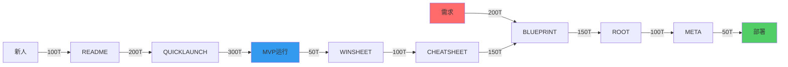

# HMNM人机协作神经回路

## 概述

人机神经元体系层(HMNM)通过构建高效的人机协作神经回路，实现精益创业过程中的智能化决策和执行。该体系基于三大神经流路径，形成完整的闭环反馈机制。

## 人机协作神经回路架构

### 三大神经流路径

| 神经流类型 | Token消耗 | 时间要求 | 成功指标 | 优化策略 |
|------------|-----------|----------|----------|----------|
| **体系设计流** | 500T | 4小时内 | 架构图完成 | 模板化决策树 |
| **战略执行流** | 800T | 24小时内 | MVP存活 | 缓存常用路径 |
| **反馈强化流** | 300T | 实时 | 问题解决率≥85% | 增量学习优化 |

### 神经流Token效率优化



## 闭环健康检测机制

### 三层闭环监控

```yaml
neural_health_check:
  architecture_loop:
    components: ["BLUEPRINT", "ROOT", "META", "运行系统", "监控反馈"]
    health_indicator: "✅架构闭环"
    check_frequency: "每4小时"
    
  survival_loop:
    components: ["QUICKLAUNCH", "MVP运行", "WINSHEET", "士气强化"]
    health_indicator: "✅生存闭环"
    check_frequency: "每日"
    
  evolution_loop:
    components: ["CHEATSHEET", "防御策略更新", "BLUEPRINT优化"]
    health_indicator: "✅进化闭环"
    check_frequency: "每周"
```

### 人机分工比例优化

| 文档类型 | 人机分工比例 | 协作模式 | 更新频率 |
|----------|-------------|----------|----------|
| **BLUEPRINT.md** | 90%:10% | 人主导设计 | 低频(体系变革) |
| **ROOT.md** | 80%:20% | 人主导决策 | 中高频(需求变更) |
| **META.md** | 30%:70% | 机器主导执行 | 实时(配置更新) |
| **QUICKLAUNCH.md** | 70%:30% | 人机平衡 | 极低频(稳定冻结) |
| **README.md** | 80%:20% | 人主导导航 | 中频(新增文档) |
| **CHEATSHEET.md** | 70%:30% | 人机协作 | 高频(随用随增) |
| **WINSHEET.md** | 50%:50% | 平衡协作 | 每日更新 |

## 协作效率指标

### 关键性能指标(KPI)

- **Token效率**: 单位Token产出价值 ≥ 1.5倍行业平均
- **响应时间**: 关键决策响应 ≤ 4小时
- **问题解决率**: 日常问题自动解决 ≥ 85%
- **迭代速度**: MVP迭代周期 ≤ 24小时
- **协作满意度**: 人机协作体验评分 ≥ 4.5/5.0

### 优化策略

1. **模板化决策树**: 标准化常见决策路径
2. **缓存常用路径**: 预加载高频使用的执行路径
3. **增量学习优化**: 基于历史数据持续优化协作模式
4. **实时反馈调整**: 根据执行效果动态调整人机分工比例

## 实施指南

### 部署步骤

1. **初始化神经回路**: 建立三大神经流基础架构
2. **配置协作比例**: 根据团队特点调整人机分工
3. **启动监控机制**: 部署闭环健康检测系统
4. **优化迭代**: 基于实际运行数据持续优化

### 注意事项

- 确保各神经流之间的数据流畅通
- 定期检查闭环健康状态
- 根据业务发展阶段调整协作模式
- 保持人机协作的平衡性和灵活性