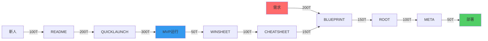

# HMNM 七份核心文档

#### 2.1.1 七份核心文档架构

| 文档类型 | 核心功能 | Token预算 | 人机分工 | 更新频率 | 创业价值 |
|----------|----------|-----------|----------|----------|----------|
| **BLUEPRINT.md** | 神经体系架构设计 | ≤{{dynamic_fields.HMNM_TOKEN_BUDGETS.example.blueprint_budget}}T | {{dynamic_fields.HUMAN_MACHINE_RATIO.example.blueprint_ratio}} | 低频(体系变革) | 技术可行性验证 |
| **ROOT.md** | 核心业务路径指令 | ≤{{dynamic_fields.HMNM_TOKEN_BUDGETS.example.root_budget}}T | {{dynamic_fields.HUMAN_MACHINE_RATIO.example.root_ratio}} | 中高频(需求变更) | 战略优先级制定 |
| **META.md** | 机器可执行配置 | ≤{{dynamic_fields.HMNM_TOKEN_BUDGETS.example.meta_budget}}T | {{dynamic_fields.HUMAN_MACHINE_RATIO.example.meta_ratio}} | 实时(配置更新) | 自动化部署 |
| **QUICKLAUNCH.md** | {{dynamic_fields.NEURAL_FLOW_BUDGETS.example.quicklaunch_time_limit}}极速启动 | ≤{{dynamic_fields.HMNM_TOKEN_BUDGETS.example.quicklaunch_budget}}T | {{dynamic_fields.HUMAN_MACHINE_RATIO.example.quicklaunch_ratio}} | 极低频(稳定冻结) | 首日MVP存活 |
| **README.md** | 项目总览导航 | ≤{{dynamic_fields.HMNM_TOKEN_BUDGETS.example.readme_budget}}T | 80%:20% | 中频(新增文档) | 认知地图建立 |
| **CHEATSHEET.md** | 高频问题速查 | ≤{{dynamic_fields.HMNM_TOKEN_BUDGETS.example.cheatsheet_budget}}T | 70%:30% | 高频(随用随增) | {{dynamic_fields.NEURAL_FLOW_BUDGETS.roi_estimate}}问题解决 |
| **WINSHEET.md** | 每日胜利记录 | ≤{{dynamic_fields.HMNM_TOKEN_BUDGETS.example.winsheet_budget}}T | 50%:50% | 每日更新 | 士气强化循环 |

#### 2.1.2 神经流Token效率优化



### 2.2 人机协作神经回路

#### 2.2.1 三大神经流路径
| 神经流类型 | Token消耗 | 时间要求 | 成功指标 | 优化策略 |
|------------|-----------|----------|----------|----------|
| **体系设计流** | {{dynamic_fields.NEURAL_FLOW_BUDGETS.example.architecture_flow}}T | {{小时}}内 | 架构图完成 | 模板化决策树 |
| **战略执行流** | {{dynamic_fields.NEURAL_FLOW_BUDGETS.example.strategy_flow}}T | {{dynamic_fields.NEURAL_FLOW_BUDGETS.example.quicklaunch_time_limit}}内 | MVP存活 | 缓存常用路径 |
| **反馈强化流** | {{dynamic_fields.NEURAL_FLOW_BUDGETS.example.feedback_flow}}T | 实时 | 问题解决率≥{{dynamic_fields.NEURAL_FLOW_BUDGETS.example.problem_solving_rate}} | 增量学习优化 |

#### 2.2.2 闭环健康检测机制
```yaml
neural_health_check:
  architecture_loop:
    components: ["BLUEPRINT", "ROOT", "META", "运行系统", "监控反馈"]
    health_indicator: "✅架构闭环"
    check_frequency: "每{{MVP小时}}"
    
  survival_loop:
    components: ["QUICKLAUNCH", "MVP运行", "WINSHEET", "士气强化"]
    health_indicator: "✅生存闭环"
    check_frequency: "每日"
    
  evolution_loop:
    components: ["CHEATSHEET", "防御策略更新", "BLUEPRINT优化"]
    health_indicator: "✅进化闭环"
    check_frequency: "每周"
```

---