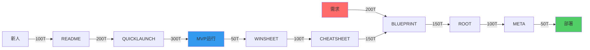

# HMNM神经流优化系统

## 概述

HMNM神经流优化系统通过七份核心文档架构，构建高效的Token流转机制，实现精益创业过程中的智能化文档管理和知识流转。

## 七份核心文档架构

### 文档体系设计

| 文档类型 | 核心功能 | Token预算 | 人机分工 | 更新频率 | 创业价值 |
|----------|----------|-----------|----------|----------|----------|
| **BLUEPRINT.md** | 神经体系架构设计 | ≤800T | 90%:10% | 低频(体系变革) | 技术可行性验证 |
| **ROOT.md** | 核心业务路径指令 | ≤600T | 80%:20% | 中高频(需求变更) | 战略优先级制定 |
| **META.md** | 机器可执行配置 | ≤400T | 30%:70% | 实时(配置更新) | 自动化部署 |
| **QUICKLAUNCH.md** | 24小时极速启动 | ≤500T | 70%:30% | 极低频(稳定冻结) | 首日MVP存活 |
| **README.md** | 项目总览导航 | ≤300T | 80%:20% | 中频(新增文档) | 认知地图建立 |
| **CHEATSHEET.md** | 高频问题速查 | ≤200T | 70%:30% | 高频(随用随增) | 5倍效率问题解决 |
| **WINSHEET.md** | 每日胜利记录 | ≤150T | 50%:50% | 每日更新 | 士气强化循环 |

### 文档功能详解

#### BLUEPRINT.md - 架构蓝图
- **核心功能**: 定义整体技术架构和系统设计
- **Token优化**: 采用模块化设计，减少重复描述
- **更新策略**: 仅在重大架构变更时更新
- **创业价值**: 为投资人展示技术可行性

#### ROOT.md - 根路径指令
- **核心功能**: 定义核心业务逻辑和执行路径
- **Token优化**: 使用决策树结构，提高可读性
- **更新策略**: 随业务需求变化及时调整
- **创业价值**: 确保团队执行方向一致

#### META.md - 元配置
- **核心功能**: 机器可直接执行的配置文件
- **Token优化**: 采用YAML格式，结构化存储
- **更新策略**: 实时同步配置变更
- **创业价值**: 实现自动化部署和运维

#### QUICKLAUNCH.md - 快速启动
- **核心功能**: 24小时内快速启动MVP
- **Token优化**: 精简到最核心的启动步骤
- **更新策略**: 保持稳定，避免频繁变更
- **创业价值**: 确保首日MVP成功上线

## 神经流Token效率优化

### 三大神经流路径



### Token流转优化策略

#### 1. 体系设计流（架构闭环）
- **起点**: 业务需求识别
- **路径**: 需求 → BLUEPRINT → ROOT → META → 部署
- **Token消耗**: 500T总预算
- **优化重点**: 减少架构设计的重复工作

#### 2. 战略执行流（生存闭环）
- **起点**: 新团队成员加入
- **路径**: 新人 → README → QUICKLAUNCH → MVP运行
- **Token消耗**: 600T总预算
- **优化重点**: 提高新人上手效率

#### 3. 反馈强化流（进化闭环）
- **起点**: MVP运行反馈
- **路径**: MVP运行 → WINSHEET → CHEATSHEET → BLUEPRINT优化
- **Token消耗**: 300T总预算
- **优化重点**: 持续改进和知识积累

## Token预算管理

### 预算分配原则

```yaml
token_budget_allocation:
  architecture_documents:
    blueprint: 800T  # 40%
    root: 600T       # 30%
    meta: 400T       # 20%
    total: 1800T     # 90%
    
  operational_documents:
    quicklaunch: 500T # 50%
    readme: 300T     # 30%
    cheatsheet: 200T # 20%
    total: 1000T     # 50%
    
  feedback_documents:
    winsheet: 150T   # 100%
    total: 150T      # 7.5%
```

### 预算监控指标

- **Token利用率**: 实际使用Token / 预算Token ≤ 95%
- **文档完整度**: 关键信息覆盖率 ≥ 90%
- **更新效率**: 单次更新Token消耗 ≤ 预算的20%
- **知识复用率**: 重复内容比例 ≤ 15%

## 神经流健康监控

### 流转效率指标

| 指标类型 | 目标值 | 监控频率 | 预警阈值 |
|----------|--------|----------|----------|
| Token流转速度 | ≥100T/小时 | 实时 | <80T/小时 |
| 文档同步延迟 | ≤5分钟 | 实时 | >10分钟 |
| 知识查找时间 | ≤30秒 | 每日 | >60秒 |
| 文档更新频率 | 符合预设 | 每周 | 偏差>50% |

### 优化建议

1. **模板化标准化**: 建立标准文档模板，减少重复工作
2. **自动化同步**: 实现文档间的自动同步更新
3. **智能索引**: 建立智能搜索和知识图谱
4. **版本控制**: 实现文档版本管理和回滚机制

## 实施指南

### 部署步骤

1. **初始化文档架构**: 创建七份核心文档模板
2. **配置Token预算**: 设置各文档的Token使用限制
3. **建立流转机制**: 配置文档间的数据流转规则
4. **启动监控系统**: 部署Token使用和效率监控
5. **持续优化**: 基于监控数据调整预算和流程

### 注意事项

- 严格控制Token预算，避免超支
- 保持文档间的一致性和同步性
- 定期评估和优化神经流路径
- 确保关键信息的及时更新和传递