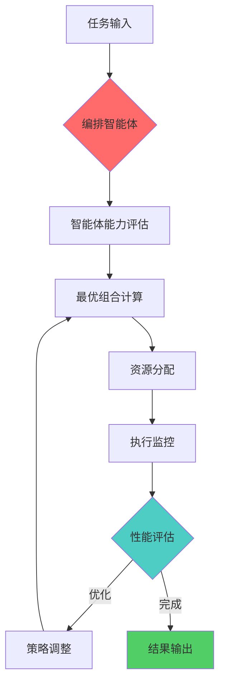

---
# YAML 前言区 | YAML Front-matter
meta:
  identifier: "maos:architecture"
  title_zh: "MAOS 智能体编排架构"
  title_en: "MAOS Agent Orchestration Architecture"
  shortTitle_zh: "MAOS架构"
  shortTitle_en: "MAOS Architecture"
  moduleType: ["核心", "core"]
  domain: ["智能体编排", "多智能体系统", "自动化协作", "精益创业"]
  version: "1.0.0"
  status: ["已迁移", "生产就绪"]
  owner: "{{系统架构师}}"
  stakeholders: ["AI工程师", "系统架构师", "智能体开发者"]
  tags: ["MAOS", "multi-agent", "orchestration", "architecture"]
  created: "2025-08-07"
  updated: "2025-08-07"
  relates_to: [
    "../../shared/fields/fields-s3out/fields.yaml",
    "../01-LNST/LNST-Overview.md",
    "../02-HMNM/HMNM-Architecture.md",
    "../../CORE-LNST-NEW.md"
  ]

# 语言配置 | Language Configuration
language:
  primary: "zh-cn"
  secondary: "en-us"
  fallback: "en-us"
  auto_detect: true

# 字段池引用配置
field_pool_config:
  source_file: "../../shared/fields/fields-s3out/fields.yaml"
  reference_method: "external_import"
  auto_sync: true
  fallback_mode: "local_cache"

# 引用方式: {{dynamic_fields.字段名}}
dynamic_fields:
  $ref: "../../shared/fields/fields-s3out/fields.yaml#/dynamic_fields"
---

# MAOS 智能体编排架构

## 3 MAOS - 智能体编排系统层\|Multi-Agent Orchestration System

### 3.1 多智能体编排架构

#### 3.1.1 六类核心智能体

| 智能体类型 | 核心功能 | Token预算/次 | N-Quads命令 | 创业阶段 | 协作模式 |
|------------|----------|-------------|-------------|----------|----------|
| **编排智能体** | 多智能体动态编排与协调 | {{dynamic_fields.AGENT_ORCHESTRATION.example.orchestration_agent}}T | `::Orchestration::(MAOS)-[initialize]->{Agent_Pool}` | 全阶段 | 中央协调 |
| **发现智能体** | 问题发现与市场研究 | {{dynamic_fields.AGENT_ORCHESTRATION.example.discovery_agent}}T | `::Discovery::(Problem)-[validate]->{Customer_Interview}` | 发现阶段 | 串行深度 |
| **验证智能体** | MVP验证与迭代优化 | {{dynamic_fields.AGENT_ORCHESTRATION.example.validation_agent}}T | `::Validation::(MVP)-[test]->{User_Feedback}` | 验证阶段 | 并行验证 |
| **开发智能体** | 产品开发与技术实现 | {{dynamic_fields.AGENT_ORCHESTRATION.example.development_agent}}T | `::Development::(Feature)-[build]->{Prototype}` | 开发阶段 | 混合协作 |
| **融资智能体** | 投资材料准备与展示 | {{dynamic_fields.AGENT_ORCHESTRATION.example.fundraising_agent}}T | `::Fundraising::(Pitch)-[generate]->{Investor_Deck}` | 融资阶段 | 自适应编排 |
| **监控智能体** | 系统监控与性能优化 | {{dynamic_fields.AGENT_ORCHESTRATION.example.monitoring_agent}}T | `::Monitor::(System)-[track]->{Performance_Metrics}` | 全阶段 | 实时监控 |

#### 3.1.2 智能体协作矩阵

| 主智能体 | 协作智能体 | 协作类型 | 数据流向 | 触发条件 | Token成本 |
|----------|------------|----------|----------|----------|----------|
| 编排智能体 | 所有智能体 | 指挥协调 | 双向 | 任务分配 | {{dynamic_fields.AGENT_ORCHESTRATION.example.orchestration_agent}}T |
| 发现智能体 | 验证智能体 | 数据传递 | 单向 | 问题验证完成 | 500T |
| 验证智能体 | 开发智能体 | 需求传递 | 单向 | MVP验证通过 | 600T |
| 开发智能体 | 监控智能体 | 状态同步 | 双向 | 系统部署 | 400T |
| 融资智能体 | 发现+验证智能体 | 内容获取 | 单向 | 融资材料需求 | 800T |
| 监控智能体 | 所有智能体 | 性能监控 | 单向接收 | 实时监控 | {{dynamic_fields.AGENT_ORCHESTRATION.example.monitoring_agent}}T |

### 3.2 精益创业智能体编排

#### 3.2.1 创业阶段智能体配置
```yaml
startup_agent_configuration:
  discovery_phase:
    primary_agents: ["discovery_agent", "orchestration_agent"]
    token_budget: {{dynamic_fields.INTEGRATED_TOKEN_BUDGET_CONTROL.example.phase_allocation.discovery}}
    success_criteria: "问题验证率≥{{dynamic_fields.VALUE_CAUSAL_CHAIN.example.discovery_chain.investor_value}}"
    key_outputs: ["客户访谈报告", "痛点分析", "市场研究"]
    
  validation_phase:
    primary_agents: ["validation_agent", "development_agent"]
    token_budget: {{dynamic_fields.INTEGRATED_TOKEN_BUDGET_CONTROL.example.phase_allocation.validation}}
    success_criteria: "MVP功能完整度≥{{dynamic_fields.INVESTOR_READINESS_SCORE.example}}"
    key_outputs: ["MVP原型", "用户反馈", "产品迭代计划"]
    
  development_phase:
    primary_agents: ["development_agent", "monitoring_agent"]
    token_budget: {{dynamic_fields.INTEGRATED_TOKEN_BUDGET_CONTROL.example.phase_allocation.development}}
    success_criteria: "系统稳定性≥{{dynamic_fields.VALUE_CAUSAL_CHAIN.development_chain.investor_value}}"
    key_outputs: ["完整产品", "技术文档", "部署方案"]
    
  launch_phase:
    primary_agents: ["development_agent", "monitoring_agent"]
    token_budget: {{dynamic_fields.INTEGRATED_TOKEN_BUDGET_CONTROL.example.phase_allocation.launch}}
    success_criteria: "用户获取成本≤$50"
    key_outputs: ["营销策略", "用户获取渠道", "运营数据"]
    
  fundraising_phase:
    primary_agents: ["fundraising_agent", "orchestration_agent"]
    token_budget: {{dynamic_fields.INTEGRATED_TOKEN_BUDGET_CONTROL.example.phase_allocation.fundraising}}
    success_criteria: "投资人就绪度≥{{dynamic_fields.INVESTOR_READINESS_SCORE.example}}"
    key_outputs: ["路演材料", "财务模型", "投资人匹配"]
```

#### 3.2.2 自适应编排机制



---