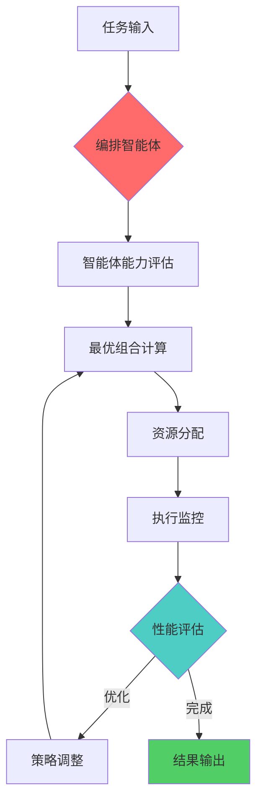

# MAOS智能体编排机制

## 概述

MAOS智能体编排机制通过自适应算法，实现多智能体的动态协调和优化配置，确保精益创业过程中的高效执行。

## 自适应编排机制

### 编排流程图



### 编排算法核心

#### 1. 智能体能力评估

```yaml
agent_capability_assessment:
  evaluation_criteria:
    - task_complexity_match: "任务复杂度匹配度"
    - resource_availability: "资源可用性"
    - historical_performance: "历史表现"
    - current_workload: "当前工作负载"
    
  scoring_algorithm:
    complexity_weight: 0.3
    availability_weight: 0.25
    performance_weight: 0.3
    workload_weight: 0.15
    
  threshold:
    minimum_score: 0.7
    optimal_score: 0.85
```

#### 2. 最优组合计算

**组合优化目标函数**:
```
Objective = Maximize(Performance × Efficiency) - Cost

where:
- Performance = Σ(Agent_Capability × Task_Weight)
- Efficiency = 1 / (Coordination_Overhead + Communication_Cost)
- Cost = Σ(Agent_Token_Cost × Usage_Time)
```

**约束条件**:
- Token预算约束: Σ(Agent_Cost) ≤ Total_Budget
- 时间约束: Max(Agent_Time) ≤ Deadline
- 资源约束: Σ(Resource_Usage) ≤ Available_Resources

#### 3. 动态资源分配

```yaml
resource_allocation_strategy:
  priority_levels:
    critical: "关键路径任务优先"
    high: "高价值任务次优先"
    medium: "常规任务正常分配"
    low: "低优先级任务延后"
    
  allocation_rules:
    - rule: "关键路径优先"
      condition: "task.is_critical_path == true"
      action: "allocate_maximum_resources"
      
    - rule: "负载均衡"
      condition: "agent.workload > 0.8"
      action: "redistribute_tasks"
      
    - rule: "预算控制"
      condition: "remaining_budget < 0.2 * total_budget"
      action: "optimize_token_usage"
```

## 创业阶段智能体配置

### 阶段化配置策略

```yaml
startup_agent_configuration:
  discovery_phase:
    primary_agents: ["discovery_agent", "orchestration_agent"]
    token_budget: 2000T
    success_criteria: "问题验证率≥80%"
    key_outputs: ["客户访谈报告", "痛点分析", "市场研究"]
    duration: "2-4周"
    
  validation_phase:
    primary_agents: ["validation_agent", "development_agent"]
    token_budget: 3000T
    success_criteria: "MVP功能完整度≥85%"
    key_outputs: ["MVP原型", "用户反馈", "产品迭代计划"]
    duration: "4-8周"
    
  development_phase:
    primary_agents: ["development_agent", "monitoring_agent"]
    token_budget: 4000T
    success_criteria: "系统稳定性≥95%"
    key_outputs: ["完整产品", "技术文档", "部署方案"]
    duration: "8-12周"
    
  launch_phase:
    primary_agents: ["development_agent", "monitoring_agent"]
    token_budget: 2500T
    success_criteria: "用户获取成本≤$50"
    key_outputs: ["营销策略", "用户获取渠道", "运营数据"]
    duration: "4-6周"
    
  fundraising_phase:
    primary_agents: ["fundraising_agent", "orchestration_agent"]
    token_budget: 3500T
    success_criteria: "投资人就绪度≥85%"
    key_outputs: ["路演材料", "财务模型", "投资人匹配"]
    duration: "6-10周"
```

### 阶段切换机制

#### 切换触发条件

```yaml
phase_transition_triggers:
  discovery_to_validation:
    conditions:
      - "market_validation_score >= 0.8"
      - "customer_interview_count >= 50"
      - "problem_solution_fit == confirmed"
    auto_trigger: true
    
  validation_to_development:
    conditions:
      - "mvp_validation_score >= 0.85"
      - "user_feedback_positive_rate >= 0.7"
      - "technical_feasibility == confirmed"
    auto_trigger: false  # 需要人工确认
    
  development_to_launch:
    conditions:
      - "system_stability >= 0.95"
      - "performance_benchmarks == passed"
      - "security_audit == completed"
    auto_trigger: false
    
  launch_to_fundraising:
    conditions:
      - "user_acquisition_cost <= 50"
      - "monthly_active_users >= 1000"
      - "revenue_growth_rate >= 0.2"
    auto_trigger: false
```

## 编排优化策略

### 性能优化

#### 1. 预测性调度

```python
# 伪代码示例
class PredictiveScheduler:
    def predict_resource_demand(self, historical_data, current_phase):
        # 基于历史数据预测资源需求
        demand_forecast = ml_model.predict(
            features=[phase, task_complexity, team_size, deadline]
        )
        return demand_forecast
    
    def optimize_schedule(self, tasks, agents, constraints):
        # 使用遗传算法优化调度
        optimal_assignment = genetic_algorithm(
            population=generate_initial_assignments(tasks, agents),
            fitness_function=calculate_performance_score,
            constraints=constraints
        )
        return optimal_assignment
```

#### 2. 负载均衡

```yaml
load_balancing_strategy:
  monitoring_interval: "5分钟"
  rebalancing_threshold: 0.8  # 负载超过80%触发重平衡
  
  rebalancing_actions:
    - action: "task_migration"
      condition: "agent.load > 0.9"
      target: "least_loaded_agent"
      
    - action: "agent_scaling"
      condition: "overall_load > 0.85"
      target: "add_backup_agent"
      
    - action: "priority_adjustment"
      condition: "deadline_pressure > 0.8"
      target: "increase_critical_task_priority"
```

### 容错机制

#### 故障检测与恢复

```yaml
fault_tolerance:
  health_check:
    interval: "30秒"
    timeout: "10秒"
    retry_count: 3
    
  failure_detection:
    response_timeout: "60秒"
    error_rate_threshold: 0.1
    performance_degradation_threshold: 0.5
    
  recovery_strategies:
    - strategy: "agent_restart"
      condition: "agent.status == unresponsive"
      max_attempts: 3
      
    - strategy: "task_reassignment"
      condition: "agent.failure_count > 3"
      backup_agent: "auto_select"
      
    - strategy: "graceful_degradation"
      condition: "system_load > 0.95"
      action: "reduce_non_critical_tasks"
```

## 监控与分析

### 关键指标监控

```yaml
monitoring_metrics:
  performance_metrics:
    - task_completion_rate
    - average_response_time
    - token_utilization_efficiency
    - agent_collaboration_success_rate
    
  business_metrics:
    - milestone_achievement_rate
    - budget_adherence
    - quality_score
    - customer_satisfaction
    
  system_metrics:
    - system_availability
    - error_rate
    - resource_utilization
    - scalability_index
```

### 持续优化

#### 学习与改进机制

1. **历史数据分析**: 分析过往项目的执行数据，识别优化机会
2. **A/B测试**: 对不同编排策略进行对比测试
3. **反馈循环**: 收集用户和智能体的反馈，持续改进
4. **模型更新**: 定期更新预测模型和优化算法

## 实施指南

### 部署步骤

1. **环境准备**: 配置编排系统运行环境
2. **智能体注册**: 注册所有可用智能体及其能力
3. **策略配置**: 设置编排策略和优化参数
4. **监控部署**: 部署监控和分析系统
5. **测试验证**: 进行端到端测试验证
6. **正式上线**: 启动生产环境运行

### 注意事项

- 确保智能体间的接口标准化
- 建立完善的日志和监控体系
- 定期备份配置和历史数据
- 保持系统的可扩展性和灵活性