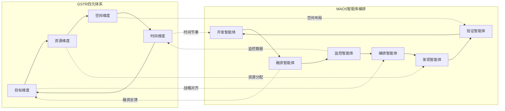

---
# YAML 前言区 | YAML Front-matter
meta:
  identifier: "gstr:framework"
  title_zh: "GSTR 四元融合体系"
  title_en: "GSTR Four-Dimensional Integration Framework"
  shortTitle_zh: "GSTR框架"
  shortTitle_en: "GSTR Framework"
  moduleType: ["核心", "core"]
  domain: ["四元体系", "战略执行", "资源管理", "精益创业"]
  version: "1.0.0"
  status: ["已迁移", "生产就绪"]
  owner: "{{系统架构师}}"
  stakeholders: ["战略规划师", "项目经理", "资源管理员"]
  tags: ["GSTR", "four-dimensional", "strategy-execution", "framework"]
  created: "2025-08-07"
  updated: "2025-08-07"
  relates_to: [
    "../../shared/fields/fields-s3out/fields.yaml",
    "../01-LNST/LNST-Overview.md",
    "GSTR-Dimensions.md",
    "../../CORE-LNST-NEW.md"
  ]

# 语言配置 | Language Configuration
language:
  primary: "zh-cn"
  secondary: "en-us"
  fallback: "en-us"
  auto_detect: true

# 字段池引用配置
field_pool_config:
  source_file: "../../shared/fields/fields-s3out/fields.yaml"
  reference_method: "external_import"
  auto_sync: true
  fallback_mode: "local_cache"

# 引用方式: {{dynamic_fields.字段名}}
dynamic_fields:
  $ref: "../../shared/fields/fields-s3out/fields.yaml#/dynamic_fields"
---

# GSTR 四元融合体系

## 4 GSTR - 目标-空间-时间-资源体系层\|Goal-Space-Time-Resource System

### 4.1 GSTR四元融合体系

#### 4.1.1 四元维度架构

| 维度 | 结构 | 执行口诀 | 核心功能 | Token预算 | 创业价值 |
|------|------|----------|----------|-----------|----------|
| **目标** | `{{dynamic_fields.GSTR_CORE_ARCHITECTURE.example.goal_structure}}` | 战略定战局，战役调资源，战术胜战场 | 决策轴：对齐OKR，防资源散射 | {{dynamic_fields.GSTR_TOKEN_BUDGETS.example.goal_dimension}}T | 战略清晰度≥95% |
| **空间** | `{{dynamic_fields.GSTR_CORE_ARCHITECTURE.example.space_structure}}` | 体统筹，面调度，线驱动，点落实 | 载体轴：抽象→具象执行拓扑 | {{dynamic_fields.GSTR_TOKEN_BUDGETS.example.space_dimension}}T | 执行成功率≥{{dynamic_fields.NEURAL_FLOW_BUDGETS.example.problem_solving_rate}} |
| **时间** | `{{dynamic_fields.GSTR_CORE_ARCHITECTURE.example.time_structure}}` | 观察全域，定位破局，决策聚能，行动释能，反馈进化 | 节奏轴：OODA闭环，灭决策延迟 | {{dynamic_fields.GSTR_TOKEN_BUDGETS.example.time_dimension}}T | 迭代速度≥{{dynamic_fields.INTEGRATED_TOKEN_BUDGET_CONTROL.example.optimization_target.efficiency_gain}} |
| **资源** | `{{dynamic_fields.GSTR_CORE_ARCHITECTURE.example.resource_structure}}` | 池定量，域调度，流驱动，元落实 | 动能轴：资源调度，阻熵增扩散 | {{dynamic_fields.GSTR_TOKEN_BUDGETS.example.resource_dimension}}T | 资源效率≥{{dynamic_fields.GSTR_TOKEN_BUDGETS.business_impact.business_value}} |

#### 4.1.2 GSTR价值因果链

```yaml
gstr_value_chain:
  goal_dimension:
    strategic_level: "愿景使命价值观"
    operational_level: "年度OKR季度里程碑"
    tactical_level: "月周日任务清单"
    
  space_dimension:
    system_level: "整体架构设计"
    surface_level: "功能模块划分"
    line_level: "流程路径设计"
    point_level: "具体执行节点"
    
  time_dimension:
    observe_phase: "环境感知与信息收集"
    orient_phase: "态势分析与定位"
    decide_phase: "决策制定与方案选择"
    act_phase: "行动执行与结果产出"
    feedback_phase: "反馈收集与学习优化"
    
  resource_dimension:
    pool_level: "总体资源池规划"
    domain_level: "领域资源分配"
    flow_level: "资源流转机制"
    element_level: "具体资源单元"
```

### 4.2 OODA循环精益创业适配

#### 4.2.1 OODA循环创业应用

| OODA阶段 | 创业活动 | 关键输出 | 时间预算 | Token预算 | 成功指标 |
|----------|----------|----------|----------|-----------|----------|
| **观察(Observe)** | 市场调研、用户访谈、竞争分析 | 市场洞察报告 | 1-2周 | 1500T | 信息完整度≥90% |
| **定位(Orient)** | 问题定义、机会识别、假设制定 | 问题假设文档 | 3-5天 | 1000T | 假设清晰度≥95% |
| **决策(Decide)** | 解决方案设计、资源分配、计划制定 | 执行计划 | 2-3天 | 800T | 计划可行性≥90% |
| **行动(Act)** | MVP构建、测试执行、数据收集 | MVP产品+数据 | 1-2周 | 2000T | 目标达成率≥85% |
| **反馈(Feedback)** | 结果分析、学习总结、策略调整 | 优化建议 | 1-2天 | 500T | 学习转化率≥80% |

#### 4.2.2 GSTR-MAOS集成优化



---