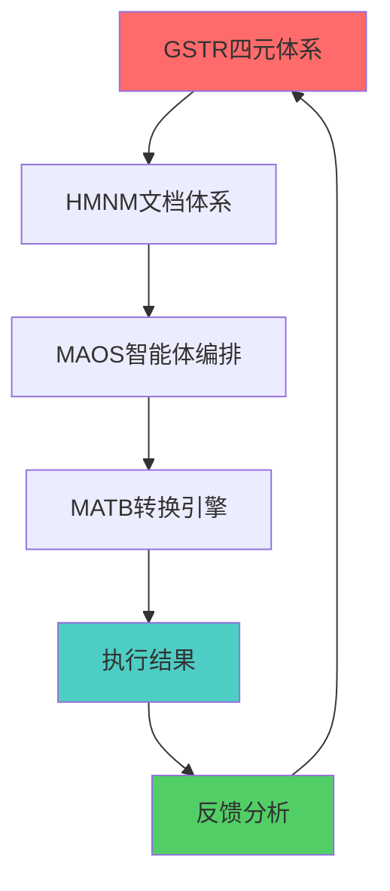

# GSTR系统集成

## 1. GSTR与其他系统集成架构

### 1.1 集成概述

GSTR四元体系（Goal-Space-Time-Resource）作为核心框架，与HMNM、MAOS、MATB等系统形成有机集成，实现精益创业的全方位支撑。

### 1.2 集成维度映射

#### 1.2.1 GSTR-HMNM集成
- **目标维度 ↔ HMNM文档体系**：战略目标通过BLUEPRINT、ROOT等文档体现
- **空间维度 ↔ HMNM架构设计**：空间布局通过META、QUICKLAUNCH等文档实现
- **时间维度 ↔ HMNM神经流**：时间节奏通过神经流优化机制控制
- **资源维度 ↔ HMNM Token预算**：资源配置通过Token预算管理实现

#### 1.2.2 GSTR-MAOS集成
- **目标维度 ↔ 编排智能体**：战略目标指导智能体编排策略
- **空间维度 ↔ 验证智能体**：空间布局支撑产品验证活动
- **时间维度 ↔ 开发智能体**：时间节奏匹配开发周期管理
- **资源维度 ↔ 发现智能体**：资源配置优化市场发现效率

#### 1.2.3 GSTR-MATB集成
- **目标维度 ↔ 语义映射**：目标通过语义映射转化为可执行指令
- **空间维度 ↔ 树形结构**：空间布局通过ASCII树形结构表达
- **时间维度 ↔ 转换流程**：时间节奏控制转换引擎的执行流程
- **资源维度 ↔ Token预算**：资源通过Token预算在转换过程中分配

## 2. 集成实施策略

### 2.1 同步集成策略

#### 2.1.1 四维同步机制
```yaml
sync_integration:
  goal_sync:
    hmnm_docs: ["BLUEPRINT", "ROOT"]
    maos_agents: ["orchestration_agent"]
    matb_formats: ["semantic_mapping"]
    
  space_sync:
    hmnm_docs: ["META", "QUICKLAUNCH"]
    maos_agents: ["validation_agent"]
    matb_formats: ["ascii_tree"]
    
  time_sync:
    hmnm_docs: ["neural_flow"]
    maos_agents: ["development_agent"]
    matb_formats: ["conversion_flow"]
    
  resource_sync:
    hmnm_docs: ["token_budget"]
    maos_agents: ["discovery_agent"]
    matb_formats: ["token_allocation"]
```

#### 2.1.2 集成监控指标
- **目标对齐度**：≥95%
- **空间覆盖率**：≥90%
- **时间同步率**：≥85%
- **资源利用率**：≥80%

### 2.2 异步集成策略

#### 2.2.1 优先级驱动集成
- **高优先级**：目标维度优先，确保战略对齐
- **中优先级**：时间维度跟进，保证执行节奏
- **低优先级**：空间和资源维度适配，优化执行效率

#### 2.2.2 阶段性集成重点
- **发现阶段**：重点集成目标和资源维度
- **验证阶段**：重点集成空间和时间维度
- **开发阶段**：重点集成时间和资源维度
- **发布阶段**：重点集成目标和空间维度

## 3. 集成优化机制

### 3.1 反馈闭环优化

#### 3.1.1 跨系统反馈机制


#### 3.1.2 优化策略
- **实时监控**：建立跨系统实时监控机制
- **异常预警**：设置集成异常的预警阈值
- **自动调整**：基于反馈自动调整集成参数

### 3.2 性能优化

#### 3.2.1 集成性能指标
- **响应时间**：≤2秒
- **吞吐量**：≥1000次/分钟
- **错误率**：≤1%
- **可用性**：≥99.9%

#### 3.2.2 优化措施
- **缓存机制**：建立多级缓存提高响应速度
- **负载均衡**：分布式部署提高处理能力
- **容错机制**：建立故障转移和恢复机制

## 4. 实施指南

### 4.1 集成部署步骤

1. **环境准备**
   - 确认各系统版本兼容性
   - 建立集成测试环境
   - 配置监控和日志系统

2. **接口对接**
   - 定义标准化接口协议
   - 实现数据格式转换
   - 建立安全认证机制

3. **功能测试**
   - 单系统功能测试
   - 集成功能测试
   - 性能压力测试

4. **上线部署**
   - 灰度发布策略
   - 监控指标配置
   - 应急预案准备

### 4.2 最佳实践

#### 4.2.1 设计原则
- **松耦合**：系统间保持松耦合，便于独立演进
- **高内聚**：单个系统内部保持高内聚，提高稳定性
- **可扩展**：预留扩展接口，支持未来功能增强

#### 4.2.2 运维建议
- **定期巡检**：建立定期的集成健康检查机制
- **版本管理**：严格控制各系统版本的兼容性
- **文档维护**：及时更新集成相关的技术文档

### 4.3 常见问题与解决方案

#### 4.3.1 数据一致性问题
- **问题描述**：跨系统数据不一致
- **解决方案**：建立数据同步机制和一致性检查

#### 4.3.2 性能瓶颈问题
- **问题描述**：集成点成为性能瓶颈
- **解决方案**：优化接口设计，采用异步处理

#### 4.3.3 故障传播问题
- **问题描述**：单点故障影响整体系统
- **解决方案**：建立熔断机制和降级策略