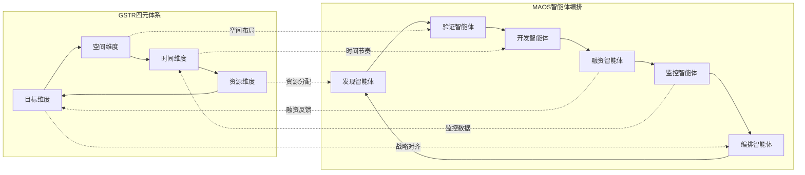

# GSTR-OODA循环精益创业适配

## 1. OODA循环创业应用

### 1.1 OODA阶段创业活动映射

| OODA阶段 | 创业活动 | 关键输出 | 时间预算 | Token预算 | 成功指标 |
|----------|----------|----------|----------|-----------|----------|
| **观察(Observe)** | 市场调研、用户访谈、竞争分析 | 市场洞察报告 | 1-2周 | 1500T | 信息完整度≥90% |
| **定位(Orient)** | 问题定义、机会识别、假设制定 | 问题假设文档 | 3-5天 | 1000T | 假设清晰度≥95% |
| **决策(Decide)** | 解决方案设计、资源分配、计划制定 | 执行计划 | 2-3天 | 800T | 计划可行性≥90% |
| **行动(Act)** | MVP构建、测试执行、数据收集 | MVP产品+数据 | 1-2周 | 2000T | 目标达成率≥85% |
| **反馈(Feedback)** | 结果分析、学习总结、策略调整 | 优化建议 | 1-2天 | 500T | 学习转化率≥80% |

### 1.2 OODA循环优化策略

#### 1.2.1 观察阶段优化
- **信息收集渠道多样化**：用户访谈、市场调研、竞品分析、行业报告
- **数据质量控制**：确保信息来源可靠性，建立信息验证机制
- **信息整合框架**：建立统一的信息收集和分析模板

#### 1.2.2 定位阶段优化
- **假设驱动分析**：基于观察结果形成可验证的假设
- **机会识别矩阵**：评估市场机会的可行性和价值
- **风险评估机制**：识别潜在风险并制定应对策略

#### 1.2.3 决策阶段优化
- **方案比较框架**：多方案对比分析，选择最优解决方案
- **资源配置优化**：基于优先级和ROI进行资源分配
- **决策时间控制**：避免分析瘫痪，在有限时间内做出决策

#### 1.2.4 行动阶段优化
- **敏捷执行方法**：采用迭代开发，快速响应变化
- **进度监控机制**：实时跟踪执行进度和质量
- **风险控制措施**：建立执行过程中的风险预警和应对机制

#### 1.2.5 反馈阶段优化
- **数据驱动分析**：基于客观数据进行结果评估
- **学习转化机制**：将反馈转化为可操作的改进建议
- **迭代优化流程**：建立持续改进的闭环机制

## 2. GSTR-MAOS集成优化

### 2.1 四元体系与智能体编排集成

### 2.2 集成优化策略

#### 2.2.1 维度对齐机制
- **目标维度-编排智能体对齐**：确保智能体编排符合战略目标
- **空间维度-验证智能体对齐**：空间布局支持产品验证
- **时间维度-开发智能体对齐**：时间节奏匹配开发周期
- **资源维度-发现智能体对齐**：优化资源配置支持市场发现

#### 2.2.2 反馈闭环优化
- **融资反馈到目标维度**：融资结果影响战略目标调整
- **监控数据到时间维度**：实时监控数据优化时间节奏
- **跨维度协同**：四个维度之间的协同优化机制

## 3. OODA循环实施指南

### 3.1 实施步骤

1. **建立OODA循环框架**
   - 定义各阶段的具体活动和输出
   - 设置时间和资源预算
   - 建立成功指标和评估标准

2. **配置智能体支持**
   - 为每个OODA阶段配置相应的智能体
   - 建立智能体间的协作机制
   - 优化智能体的Token使用效率

3. **建立监控机制**
   - 实时跟踪OODA循环的执行进度
   - 监控各阶段的质量和效率
   - 建立预警和调整机制

### 3.2 最佳实践

- **快速迭代**：缩短OODA循环周期，提高响应速度
- **数据驱动**：基于客观数据进行决策和优化
- **持续学习**：建立学习型组织，不断改进OODA循环
- **风险控制**：在每个阶段都要考虑风险因素

### 3.3 常见问题与解决方案

#### 3.3.1 观察阶段问题
- **信息过载**：建立信息筛选和优先级机制
- **信息不准确**：建立多渠道验证机制

#### 3.3.2 定位阶段问题
- **假设不清晰**：使用结构化的假设制定模板
- **分析瘫痪**：设置分析时间上限

#### 3.3.3 决策阶段问题
- **决策延迟**：建立决策时间限制和升级机制
- **资源冲突**：建立资源优先级和分配机制

#### 3.3.4 行动阶段问题
- **执行偏差**：建立实时监控和纠偏机制
- **资源不足**：建立资源预警和调配机制

#### 3.3.5 反馈阶段问题
- **反馈延迟**：建立快速反馈收集机制
- **学习转化不足**：建立结构化的学习转化流程