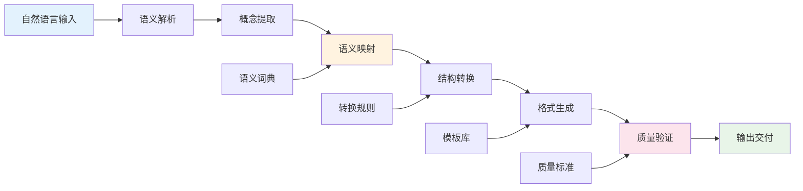

---
# YAML 前言区 | YAML Front-matter
meta:
  identifier: "matb:semantic-mapping"
  title_zh: "MATB语义映射系统"
  title_en: "MATB Semantic Mapping System"
  shortTitle_zh: "语义映射"
  shortTitle_en: "Semantic Mapping"
  moduleType: ["核心", "core"]
  domain: ["语义映射", "概念转换", "精益创业", "自动化理解"]
  version: "1.0.0"
  status: ["已迁移", "生产就绪"]
  owner: "{{系统架构师}}"
  stakeholders: ["AI工程师", "语义工程师", "产品经理"]
  tags: ["MATB", "semantic-mapping", "concept-conversion", "automation"]
  created: "2025-08-07"
  updated: "2025-08-07"
  relates_to: [
    "../../shared/fields/fields-s3out/fields.yaml",
    "MATB-ConversionEngine.md",
    "MATB-AgentSyntax.md",
    "../01-LNST/LNST-Overview.md"
  ]

# 语言配置 | Language Configuration
language:
  primary: "zh-cn"
  secondary: "en-us"
  fallback: "en-us"
  auto_detect: true

# 字段池引用配置
field_pool_config:
  source_file: "../../shared/fields/fields-s3out/fields.yaml"
  reference_method: "external_import"
  auto_sync: true
  fallback_mode: "local_cache"

# 引用方式: {{dynamic_fields.字段名}}
dynamic_fields:
  $ref: "../../shared/fields/fields-s3out/fields.yaml#/dynamic_fields"
---

# MATB语义映射系统

## 概述

MATB（Markdown-ASCII树形桥接层）语义映射系统提供了精益创业语义映射功能，支持创业概念与技术实现之间的自动转换和语义理解。

## 精益创业语义映射

### 转换类型与规范

#### 核心转换类型
```yaml
conversion_types:
  HTx_to_ATr: # Human Text to Architecture Tree
    description: "人类文本到架构树转换"
    accuracy_target: "≥95%"
    use_cases: ["需求分析", "架构设计", "技术规划"]
    
  ATr_to_MDT: # Architecture Tree to Markdown Document Tree
    description: "架构树到Markdown文档树转换"
    accuracy_target: "≥90%"
    use_cases: ["文档生成", "API文档", "技术文档"]
    
  MDT_to_VIS: # Markdown Document Tree to Visualization
    description: "Markdown文档树到可视化转换"
    accuracy_target: "≥85%"
    use_cases: ["流程图", "架构图", "决策树"]
    
  NQd_to_EXE: # N-Quads to Execution
    description: "N-Quads语义到执行指令转换"
    accuracy_target: "≥98%"
    use_cases: ["智能体调用", "任务执行", "工作流编排"]
```

#### 转换精度标准
| 转换类型 | 语义保真度 | 结构完整性 | 执行准确性 | 应用场景 |
|----------|------------|------------|------------|----------|
| **HTx→ATr** | ≥95% | ≥90% | ≥85% | 需求到架构 |
| **ATr→MDT** | ≥90% | ≥95% | ≥90% | 架构到文档 |
| **MDT→VIS** | ≥85% | ≥80% | ≥85% | 文档到可视化 |
| **NQd→EXE** | ≥98% | ≥95% | ≥98% | 语义到执行 |

### 创业语义词典

#### 创业阶段语义映射
```yaml
startup_phase_semantics:
  discovery:
    keywords: ["市场调研", "用户访谈", "问题验证", "需求分析"]
    technical_mapping:
      - "用户访谈" → "data_collection_agent"
      - "市场调研" → "market_analysis_module"
      - "问题验证" → "hypothesis_testing_framework"
    
  validation:
    keywords: ["MVP测试", "假设验证", "用户反馈", "产品验证"]
    technical_mapping:
      - "MVP测试" → "prototype_testing_system"
      - "假设验证" → "validation_engine"
      - "用户反馈" → "feedback_collection_api"
    
  development:
    keywords: ["产品开发", "功能实现", "技术架构", "系统集成"]
    technical_mapping:
      - "产品开发" → "development_pipeline"
      - "功能实现" → "feature_implementation_module"
      - "技术架构" → "architecture_design_system"
    
  launch:
    keywords: ["产品发布", "市场推广", "用户获取", "运营优化"]
    technical_mapping:
      - "产品发布" → "deployment_automation"
      - "市场推广" → "marketing_automation_system"
      - "用户获取" → "user_acquisition_pipeline"
    
  fundraising:
    keywords: ["投资准备", "路演展示", "融资谈判", "投资人对接"]
    technical_mapping:
      - "投资准备" → "investor_readiness_assessment"
      - "路演展示" → "pitch_generation_system"
      - "融资谈判" → "negotiation_support_tools"
```

#### 智能体能力语义映射
```yaml
agent_capability_semantics:
  discovery_agent:
    semantic_domain: ["市场分析", "用户研究", "竞品调研", "趋势预测"]
    input_formats: ["自然语言查询", "结构化数据", "市场报告"]
    output_formats: ["分析报告", "数据可视化", "洞察摘要"]
    
  validation_agent:
    semantic_domain: ["假设验证", "测试执行", "结果评估", "风险分析"]
    input_formats: ["测试计划", "验证标准", "数据样本"]
    output_formats: ["验证报告", "测试结果", "改进建议"]
    
  development_agent:
    semantic_domain: ["产品开发", "技术实现", "架构设计", "代码生成"]
    input_formats: ["需求文档", "技术规范", "设计图"]
    output_formats: ["代码实现", "技术文档", "部署包"]
    
  fundraising_agent:
    semantic_domain: ["融资策略", "投资人对接", "材料准备", "估值分析"]
    input_formats: ["财务数据", "商业计划", "市场信息"]
    output_formats: ["融资方案", "投资材料", "路演PPT"]
```

### 语义转换引擎

#### 转换流水线


#### 转换规则引擎
```yaml
conversion_rules:
  semantic_extraction:
    entity_recognition:
      - pattern: "用户访谈\\d+个"
        extraction: "user_interviews"
        parameters: ["count"]
      - pattern: "MVP功能\\d+项"
        extraction: "mvp_features"
        parameters: ["feature_count"]
        
    relationship_mapping:
      - source: "市场调研"
        target: "用户访谈"
        relationship: "includes"
      - source: "产品验证"
        target: "用户反馈"
        relationship: "depends_on"
        
  structure_transformation:
    hierarchy_rules:
      - level_1: "创业阶段"
        level_2: "核心任务"
        level_3: "具体活动"
        level_4: "执行步骤"
        
    format_templates:
      markdown_tree:
        pattern: "# {{level_1}}\n## {{level_2}}\n### {{level_3}}\n- {{level_4}}"
      ascii_tree:
        pattern: "{{level_1}}\n├── {{level_2}}\n│   └── {{level_3}}\n│       └── {{level_4}}"
```

### 质量保证机制

#### 转换质量评估
```yaml
quality_assessment:
  semantic_fidelity:
    metrics:
      - "概念保真度": "原始语义与转换结果的匹配度"
      - "关系完整性": "概念间关系的保持程度"
      - "上下文一致性": "语义上下文的连贯性"
    threshold: 0.95
    
  structural_integrity:
    metrics:
      - "层次结构": "树形结构的正确性"
      - "节点完整性": "所有节点的正确转换"
      - "连接关系": "节点间连接的准确性"
    threshold: 0.90
    
  execution_accuracy:
    metrics:
      - "指令正确性": "生成指令的可执行性"
      - "参数完整性": "参数传递的准确性"
      - "错误处理": "异常情况的处理能力"
    threshold: 0.98
```

#### 自动化质量检测
```yaml
automated_quality_check:
  syntax_validation:
    markdown_syntax: "检查Markdown语法正确性"
    ascii_tree_format: "验证ASCII树格式规范"
    nquads_structure: "验证N-Quads语法结构"
    
  semantic_validation:
    concept_consistency: "检查概念一致性"
    relationship_validity: "验证关系有效性"
    domain_alignment: "确保领域对齐"
    
  performance_validation:
    conversion_speed: "转换速度测试"
    memory_usage: "内存使用监控"
    accuracy_benchmark: "准确性基准测试"
```

### 优化策略

#### 转换效率优化
```yaml
optimization_strategies:
  caching_mechanism:
    semantic_cache: "语义解析结果缓存"
    template_cache: "转换模板缓存"
    rule_cache: "转换规则缓存"
    
  parallel_processing:
    batch_conversion: "批量转换处理"
    pipeline_parallelism: "流水线并行化"
    distributed_processing: "分布式处理"
    
  adaptive_learning:
    pattern_learning: "转换模式学习"
    quality_feedback: "质量反馈优化"
    rule_evolution: "规则进化机制"
```

#### 错误处理与恢复
```yaml
error_handling:
  error_types:
    syntax_error: "语法错误处理"
    semantic_error: "语义错误处理"
    conversion_error: "转换错误处理"
    
  recovery_strategies:
    fallback_rules: "回退规则机制"
    manual_intervention: "人工干预接口"
    partial_conversion: "部分转换策略"
    
  error_reporting:
    error_classification: "错误分类统计"
    quality_metrics: "质量指标报告"
    improvement_suggestions: "改进建议生成"
```

---

## 总结

MATB语义映射系统通过精确的语义转换和质量保证机制，确保创业概念与技术实现之间的无缝转换，为精益创业提供强大的语义理解和自动化支持。