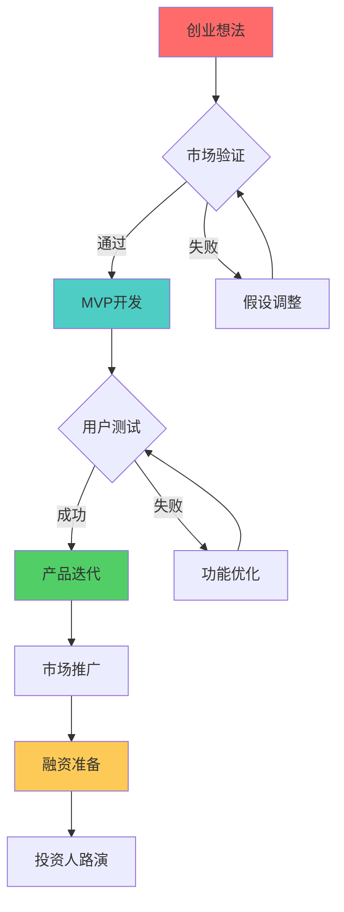

---
# YAML 前言区 | YAML Front-matter
meta:
  identifier: "matb:visualization"
  title_zh: "MATB 可视化系统"
  title_en: "MATB Visualization System"
  shortTitle_zh: "可视化"
  shortTitle_en: "Visualization"
  moduleType: ["核心", "core"]
  domain: ["数据可视化", "图形展示", "交互界面", "用户体验"]
  version: "1.0.0"
  status: ["已迁移", "生产就绪"]
  owner: "{{系统架构师}}"
  stakeholders: ["前端工程师", "UI/UX设计师", "产品经理"]
  tags: ["MATB", "visualization", "data-display", "user-interface"]
  created: "2025-08-07"
  updated: "2025-08-07"
  relates_to: [
    "../../shared/fields/fields-s3out/fields.yaml",
    "MATB-ConversionEngine.md",
    "MATB-SemanticMapping.md",
    "../02-HMNM/HMNM-Documents.md"
  ]

# 语言配置 | Language Configuration
language:
  primary: "zh-cn"
  secondary: "en-us"
  fallback: "en-us"
  auto_detect: true

# 字段池引用配置
field_pool_config:
  source_file: "../../shared/fields/fields-s3out/fields.yaml"
  reference_method: "external_import"
  auto_sync: true
  fallback_mode: "local_cache"

# 引用方式: {{dynamic_fields.字段名}}
dynamic_fields:
  $ref: "../../shared/fields/fields-s3out/fields.yaml#/dynamic_fields"
---

# MATB 可视化系统

## 概述

MATB（Markdown-ASCII树形桥接层）可视化输出系统提供了多种可视化格式的自动生成功能，支持创业决策树、流程图、架构图等多种可视化需求。

## 可视化输出优化

### 创业决策树可视化

#### 决策树结构设计


#### 决策节点类型定义
```yaml
decision_node_types:
  start_node:
    symbol: "圆角矩形"
    color: "#ff6b6b"
    description: "创业起点节点"
    examples: ["创业想法", "市场机会", "技术突破"]
    
  decision_node:
    symbol: "菱形"
    color: "#feca57"
    description: "关键决策点"
    examples: ["市场验证", "用户测试", "融资决策"]
    
  process_node:
    symbol: "矩形"
    color: "#4ecdc4"
    description: "执行过程节点"
    examples: ["MVP开发", "产品迭代", "市场推广"]
    
  success_node:
    symbol: "圆角矩形"
    color: "#51cf66"
    description: "成功里程碑"
    examples: ["产品上线", "用户增长", "融资成功"]
    
  failure_node:
    symbol: "矩形"
    color: "#ff7675"
    description: "失败或调整点"
    examples: ["假设调整", "功能优化", "策略转向"]
```

### 流程图生成系统

#### 自动化流程图生成
```yaml
flowchart_generation:
  input_formats:
    - "自然语言描述"
    - "结构化数据"
    - "YAML配置"
    - "JSON规范"
    
  output_formats:
    - "Mermaid流程图"
    - "ASCII艺术图"
    - "SVG矢量图"
    - "PNG位图"
    
  generation_rules:
    node_spacing: "自动计算节点间距"
    layout_optimization: "布局自动优化"
    color_scheme: "智能配色方案"
    label_positioning: "标签位置优化"
```

#### 创业流程模板库
```yaml
startup_flow_templates:
  lean_startup_cycle:
    template_name: "精益创业循环"
    structure:
      - "构建 → 测量 → 学习 → 构建"
    mermaid_code: |
      flowchart LR
          A[构建] --> B[测量]
          B --> C[学习]
          C --> A
          
  mvp_development:
    template_name: "MVP开发流程"
    structure:
      - "需求分析 → 原型设计 → 开发实现 → 测试验证 → 发布上线"
    mermaid_code: |
      flowchart TD
          A[需求分析] --> B[原型设计]
          B --> C[开发实现]
          C --> D[测试验证]
          D --> E[发布上线]
          
  fundraising_process:
    template_name: "融资流程"
    structure:
      - "准备材料 → 投资人筛选 → 路演展示 → 尽职调查 → 条款谈判 → 签约交割"
    mermaid_code: |
      flowchart TD
          A[准备材料] --> B[投资人筛选]
          B --> C[路演展示]
          C --> D[尽职调查]
          D --> E[条款谈判]
          E --> F[签约交割]
```

### ASCII艺术图生成

#### ASCII树形结构
```
startup_ecosystem:
├── 创业团队
│   ├── 创始人
│   │   ├── CEO (首席执行官)
│   │   ├── CTO (首席技术官)
│   │   └── CMO (首席营销官)
│   ├── 核心员工
│   │   ├── 产品经理
│   │   ├── 开发工程师
│   │   └── 市场专员
│   └── 顾问团队
│       ├── 行业专家
│       ├── 技术顾问
│       └── 投资顾问
├── 产品开发
│   ├── 市场调研
│   ├── 需求分析
│   ├── 产品设计
│   ├── 技术开发
│   └── 测试验证
└── 商业运营
    ├── 市场推广
    ├── 用户获取
    ├── 收入模式
    └── 融资计划
```

#### ASCII图表生成规则
```yaml
ascii_generation_rules:
  tree_structure:
    root_symbol: "根节点标识"
    branch_symbols: ["├──", "└──", "│"]
    indentation: "4个空格为一级缩进"
    
  chart_types:
    organizational_chart: "组织架构图"
    process_flow: "流程图"
    hierarchy_tree: "层次结构树"
    timeline_chart: "时间线图表"
    
  formatting_rules:
    max_width: 80  # 最大行宽
    alignment: "左对齐"
    spacing: "统一间距"
    encoding: "UTF-8"
```

### 交互式可视化

#### 动态图表生成
```yaml
interactive_visualization:
  chart_types:
    gantt_chart:
      description: "甘特图时间线"
      use_case: "项目进度管理"
      features: ["时间轴", "任务依赖", "进度跟踪"]
      
    kanban_board:
      description: "看板任务管理"
      use_case: "敏捷开发管理"
      features: ["任务卡片", "状态流转", "优先级标识"]
      
    dashboard:
      description: "数据仪表板"
      use_case: "关键指标监控"
      features: ["实时数据", "图表展示", "告警提醒"]
```

#### 实时数据可视化
```yaml
real_time_visualization:
  data_sources:
    - "智能体执行状态"
    - "Token使用情况"
    - "任务完成进度"
    - "系统性能指标"
    
  update_frequency:
    high_priority: "1秒更新"
    medium_priority: "5秒更新"
    low_priority: "30秒更新"
    
  visualization_components:
    progress_bars: "进度条显示"
    status_indicators: "状态指示器"
    trend_charts: "趋势图表"
    alert_notifications: "告警通知"
```

### 可视化优化策略

#### 性能优化
```yaml
performance_optimization:
  rendering_optimization:
    lazy_loading: "延迟加载大型图表"
    caching_strategy: "图表缓存机制"
    compression: "图像压缩优化"
    
  responsive_design:
    mobile_adaptation: "移动端适配"
    screen_scaling: "屏幕缩放支持"
    touch_interaction: "触摸交互优化"
    
  accessibility:
    color_blind_support: "色盲友好配色"
    screen_reader: "屏幕阅读器支持"
    keyboard_navigation: "键盘导航支持"
```

#### 用户体验优化
```yaml
user_experience_optimization:
  interaction_design:
    hover_effects: "悬停效果"
    click_feedback: "点击反馈"
    drag_and_drop: "拖拽操作"
    
  customization:
    theme_selection: "主题选择"
    layout_adjustment: "布局调整"
    color_customization: "颜色自定义"
    
  export_options:
    image_export: "图像导出"
    pdf_generation: "PDF生成"
    data_export: "数据导出"
```

### 质量保证

#### 可视化质量标准
```yaml
visualization_quality_standards:
  clarity:
    readability: "文字清晰可读"
    contrast_ratio: "对比度≥4.5:1"
    font_size: "最小字体12px"
    
  accuracy:
    data_integrity: "数据完整性100%"
    scale_consistency: "比例一致性"
    label_accuracy: "标签准确性"
    
  aesthetics:
    color_harmony: "色彩和谐"
    layout_balance: "布局平衡"
    visual_hierarchy: "视觉层次"
```

#### 自动化测试
```yaml
automated_testing:
  visual_regression:
    screenshot_comparison: "截图对比测试"
    layout_validation: "布局验证"
    rendering_consistency: "渲染一致性"
    
  performance_testing:
    load_time_measurement: "加载时间测量"
    memory_usage_monitoring: "内存使用监控"
    fps_tracking: "帧率跟踪"
    
  accessibility_testing:
    wcag_compliance: "WCAG合规性检查"
    keyboard_navigation: "键盘导航测试"
    screen_reader_compatibility: "屏幕阅读器兼容性"
```

---

## 总结

MATB可视化输出系统通过多样化的可视化格式和优化策略，为创业团队提供了直观、高效的信息展示和决策支持工具，确保复杂的创业流程和数据能够以清晰、美观的方式呈现。