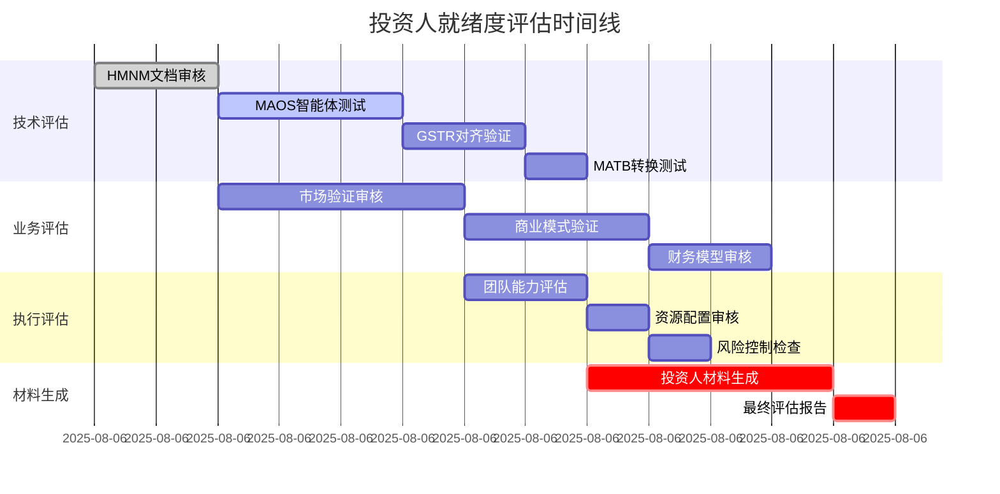

---
# YAML 前言区 | YAML Front-matter
meta:
  identifier: "integration:assessment"
  title_zh: "投资人就绪度评估"
  title_en: "Investor Readiness Assessment"
  shortTitle_zh: "投资评估"
  shortTitle_en: "Investment Assessment"
  moduleType: ["集成", "integration"]
  domain: ["投资评估", "就绪度评估", "融资准备", "精益创业"]
  version: "1.0.0"
  status: ["已迁移", "生产就绪"]
  owner: "{{系统架构师}}"
  stakeholders: ["创始人", "投资人", "财务负责人", "业务负责人"]
  tags: ["investor-readiness", "assessment", "fundraising", "evaluation"]
  created: "2025-08-07"
  updated: "2025-08-07"
  relates_to: [
    "../../shared/fields/fields-s3out/fields.yaml",
    "../01-LNST/LNST-InvestorReadiness.md",
    "Integration-TokenEconomy.md",
    "Integration-MVPFlow.md",
    "../../CORE-LNST-NEW.md"
  ]

# 语言配置 | Language Configuration
language:
  primary: "zh-cn"
  secondary: "en-us"
  fallback: "en-us"
  auto_detect: true

# 字段池引用配置
field_pool_config:
  source_file: "../../shared/fields/fields-s3out/fields.yaml"
  reference_method: "external_import"
  auto_sync: true
  fallback_mode: "local_cache"

# 引用方式: {{dynamic_fields.字段名}}
dynamic_fields:
  $ref: "../../shared/fields/fields-s3out/fields.yaml#/dynamic_fields"
---

# 投资人就绪度评估

## 概述

投资人就绪度评估是LNST精益创业统筹中枢的核心评估机制，通过综合评估技术就绪度、业务就绪度和执行就绪度，确保创业项目达到投资人标准。

## 综合评估框架

```yaml
investor_readiness_assessment:
  technical_readiness:
    weight: 30%
    components:
      - "HMNM文档体系完整性"
      - "MAOS智能体协作效率"
      - "GSTR执行对齐度"
      - "MATB转换准确性"
    target_score: "≥90%"
    
  business_readiness:
    weight: 40%
    components:
      - "LNST精益创业验证"
      - "市场机会评估"
      - "商业模式验证"
      - "财务模型健康度"
    target_score: "≥85%"
    
  execution_readiness:
    weight: 30%
    components:
      - "团队能力匹配"
      - "资源配置合理性"
      - "风险控制机制"
      - "扩展能力规划"
    target_score: "≥80%"
    
  overall_target: "≥90%"
```

## 投资人材料自动生成

### 材料生成矩阵

| 材料类型 | 生成智能体 | Token预算 | 生成时间 | 质量标准 |
|----------|------------|-----------|----------|----------|
| **执行摘要** | 融资智能体 | 800T | 30分钟 | 投资人关注点覆盖≥95% |
| **商业计划书** | 发现+融资智能体 | 2000T | 2小时 | 逻辑完整性≥90% |
| **财务模型** | 融资智能体 | 1500T | 1小时 | 数据准确性≥98% |
| **路演PPT** | 融资智能体 | 1200T | 1.5小时 | 视觉吸引力≥85% |
| **技术文档** | 开发智能体 | 1000T | 1小时 | 技术可行性≥95% |
| **市场分析** | 发现智能体 | 1500T | 1.5小时 | 数据支撑度≥90% |

### 投资人评估五要素

```yaml
investor_evaluation_framework:
  problem_validation:
    weight: 20%
    requirements: ["客户访谈≥20个", "问题验证率≥80%", "市场规模≥$100M"]
    deliverables: ["客户访谈报告", "痛点分析", "市场研究"]
    
  solution_demonstration:
    weight: 25%
    requirements: ["MVP功能完整度≥90%", "用户满意度≥85%", "技术可行性验证"]
    deliverables: ["MVP演示", "用户反馈报告", "技术架构文档"]
    
  market_opportunity:
    weight: 20%
    requirements: ["TAM≥$100M", "SAM≥$10M", "SOM≥$1M", "竞争分析完整"]
    deliverables: ["市场分析报告", "竞争对手分析", "市场进入策略"]
    
  traction_metrics:
    weight: 20%
    requirements: ["用户增长率≥20%", "留存率≥60%", "收入增长验证"]
    deliverables: ["用户数据仪表板", "财务报表", "增长指标"]
    
  team_capability:
    weight: 15%
    requirements: ["核心团队完整", "相关经验≥3年", "执行能力验证"]
    deliverables: ["团队介绍", "履历背景", "执行记录"]
```

## 评估流程与时间线

### 评估阶段划分



## 评估指标监控

### 实时评估仪表板

```yaml
assessment_dashboard:
  real_time_metrics:
    - "技术就绪度得分"
    - "业务就绪度得分"
    - "执行就绪度得分"
    - "综合就绪度得分"
    - "材料生成进度"
    
  alert_thresholds:
    technical_readiness: 0.9
    business_readiness: 0.85
    execution_readiness: 0.8
    overall_readiness: 0.9
    
  optimization_triggers:
    score_below_threshold: "自动优化建议"
    material_quality_low: "内容增强提示"
    timeline_delay: "资源重新分配"
```

---