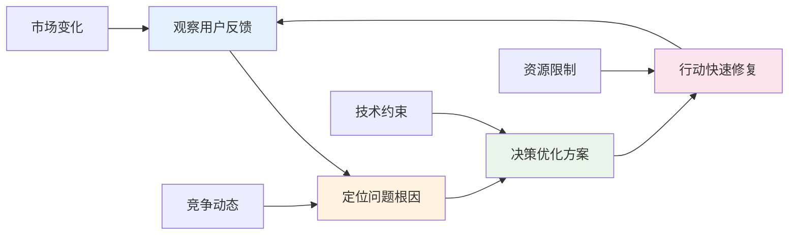

---
# YAML 前言区 | YAML Front-matter
meta:
  identifier: "integration:mvp-flow"
  title_zh: "MVP上线流程"
  title_en: "MVP Launch Flow"
  shortTitle_zh: "MVP流程"
  shortTitle_en: "MVP Flow"
  moduleType: ["集成", "integration"]
  domain: ["MVP开发", "上线流程", "快速迭代", "精益创业"]
  version: "1.0.0"
  status: ["已迁移", "生产就绪"]
  owner: "{{系统架构师}}"
  stakeholders: ["创始人", "产品经理", "技术负责人", "运营负责人"]
  tags: ["mvp", "launch-flow", "quick-iteration", "deployment"]
  created: "2025-08-07"
  updated: "2025-08-07"
  relates_to: [
    "../../shared/fields/fields-s3out/fields.yaml",
    "../01-LNST/LNST-Phases.md",
    "../02-HMNM/HMNM-Architecture.md",
    "../03-MAOS/MAOS-Architecture.md",
    "Integration-TokenEconomy.md",
    "../../CORE-LNST-NEW.md"
  ]

# 语言配置 | Language Configuration
language:
  primary: "zh-cn"
  secondary: "en-us"
  fallback: "en-us"
  auto_detect: true

# 字段池引用配置
field_pool_config:
  source_file: "../../shared/fields/fields-s3out/fields.yaml"
  reference_method: "external_import"
  auto_sync: true
  fallback_mode: "local_cache"

# 引用方式: {{dynamic_fields.字段名}}
dynamic_fields:
  $ref: "../../shared/fields/fields-s3out/fields.yaml#/dynamic_fields"
---

# MVP上线流程

## 概述

MVP上线流程是LNST精益创业统筹中枢的核心执行机制，通过24小时快速迭代周期，确保最小可行产品的快速验证和上线。

## 24小时MVP关键路径

### 关键里程碑时间线

```gantt
title 24小时MVP上线关键路径
section LNST精益创业
需求分析        :done, req, 2025-08-06, 2h
假设制定        :done, hyp, after req, 1h
section HMNM神经文档
BLUEPRINT设计   :active, bp, after hyp, 3h
ROOT指令制定    :root, after bp, 1h
META配置生成    :meta, after root, 1h
section MAOS智能体
智能体激活      :agent, after meta, 1h
编排系统启动    :orch, after agent, 2h
section GSTR执行
目标对齐        :goal, after orch, 1h
资源分配        :res, after goal, 2h
section MATB转换
格式转换        :conv, after res, 1h
可视化生成      :vis, after conv, 1h
section MVP交付
MVP构建         :crit, mvp, after vis, 6h
测试验证        :test, after mvp, 2h
上线部署        :crit, deploy, after test, 1h
```

### 成功指标监控

| 时间节点 | 关键指标 | 目标值 | 监控方式 | 风险控制 |
|----------|----------|--------|----------|----------|
| **6小时** | HMNM文档完成度 | ≥90% | 自动检测 | 模板回退 |
| **12小时** | MAOS智能体就绪 | ≥95% | 状态监控 | 手动介入 |
| **18小时** | GSTR执行进度 | ≥85% | 进度跟踪 | 资源调整 |
| **22小时** | MVP功能完整度 | ≥80% | 功能测试 | 范围缩减 |
| **24小时** | 系统可用性 | ≥99% | 健康检查 | 紧急修复 |

## MVP构建流程

### 四阶段构建策略

```yaml
mvp_build_phases:
  phase_1_foundation:
    duration: "前6小时"
    objectives: ["基础设施搭建", "核心架构设计", "开发环境准备"]
    deliverables: ["HMNM文档体系", "MAOS智能体激活", "GSTR框架初始化"]
    success_criteria: "基础设施就绪度≥90%"
    
  phase_2_core_development:
    duration: "6-12小时"
    objectives: ["核心功能开发", "API接口实现", "数据库搭建"]
    deliverables: ["核心功能模块", "API文档", "数据模型"]
    success_criteria: "核心功能完成度≥85%"
    
  phase_3_integration:
    duration: "12-18小时"
    objectives: ["系统集成", "第三方服务", "安全机制"]
    deliverables: ["集成系统", "安全配置", "性能优化"]
    success_criteria: "集成测试通过率≥95%"
    
  phase_4_deployment:
    duration: "18-24小时"
    objectives: ["生产部署", "用户测试", "监控配置"]
    deliverables: ["生产环境", "用户反馈", "监控仪表板"]
    success_criteria: "系统可用性≥99%"
```

### MVP质量控制

```yaml
quality_control:
  automated_testing:
    unit_tests: "代码覆盖率≥80%"
    integration_tests: "接口测试通过率≥95%"
    performance_tests: "响应时间≤2秒"
    
  manual_validation:
    user_acceptance: "用户满意度≥85%"
    business_logic: "业务逻辑正确性≥95%"
    security_check: "安全漏洞数量=0"
    
  deployment_readiness:
    infrastructure: "基础设施稳定性≥99%"
    monitoring: "监控覆盖率≥90%"
    backup: "备份恢复机制验证"
```

## 快速迭代机制

### OODA循环在MVP中的应用



### 迭代优化策略

| 迭代周期 | 优化重点 | 成功指标 | 资源分配 |
|----------|----------|----------|----------|
| **第1周期** | 核心功能稳定性 | 系统稳定性≥95% | 开发70%，测试30% |
| **第2周期** | 用户体验优化 | 用户满意度≥85% | 开发50%，设计50% |
| **第3周期** | 性能与扩展性 | 响应时间≤1秒 | 开发60%，运维40% |
| **第4周期** | 商业化准备 | 转化率≥10% | 开发40%，运营60% |

---