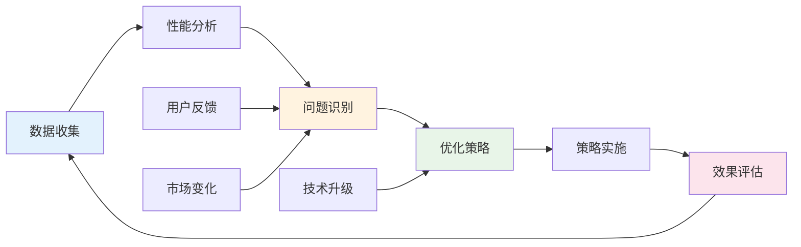

---
# YAML 前言区 | YAML Front-matter
meta:
  identifier: "integration:optimization"
  title_zh: "统筹中枢集成优化"
  title_en: "Central Integration Optimization"
  shortTitle_zh: "集成优化"
  shortTitle_en: "Integration Optimization"
  moduleType: ["集成", "integration"]
  domain: ["系统集成", "性能优化", "架构优化", "精益创业"]
  version: "1.0.0"
  status: ["已迁移", "生产就绪"]
  owner: "{{系统架构师}}"
  stakeholders: ["技术负责人", "系统架构师", "性能工程师"]
  tags: ["integration", "optimization", "performance", "architecture"]
  created: "2025-08-07"
  updated: "2025-08-07"
  relates_to: [
    "../../shared/fields/fields-s3out/fields.yaml",
    "../01-LNST/LNST-Overview.md",
    "../02-HMNM/HMNM-Architecture.md",
    "../03-MAOS/MAOS-Architecture.md",
    "../04-GSTR/GSTR-Framework.md",
    "../05-MATB/MATB-Conversion.md",
    "Integration-TokenEconomy.md",
    "../../CORE-LNST-NEW.md"
  ]

# 语言配置 | Language Configuration
language:
  primary: "zh-cn"
  secondary: "en-us"
  fallback: "en-us"
  auto_detect: true

# 字段池引用配置
field_pool_config:
  source_file: "../../shared/fields/fields-s3out/fields.yaml"
  reference_method: "external_import"
  auto_sync: true
  fallback_mode: "local_cache"

# 引用方式: {{dynamic_fields.字段名}}
dynamic_fields:
  $ref: "../../shared/fields/fields-s3out/fields.yaml#/dynamic_fields"
---

# 统筹中枢集成优化

## 概述

统筹中枢集成优化模块整合了LNST精益创业、HMNM人机神经元体系、MAOS多智能体编排系统、GSTR四元体系和MATB树形桥接五大核心组件，构建完整的创业技术栈。

## 五层价值流集成

### Token经济性优化

| 优化层级 | 优化策略 | Token节省率 | 实现方式 | 创业价值 |
|----------|----------|-------------|----------|----------|
| **LNST层** | 阶段性加载 | 50% | 按创业阶段激活功能 | 资源聚焦 |
| **HMNM层** | 模板复用 | 40% | {{变量}}占位符系统 | 标准化效率 |
| **MAOS层** | 按需激活 | 60% | 智能体动态编排 | 协作效率 |
| **GSTR层** | 符号化压缩 | 30% | 四元体系符号映射 | 语义压缩 |
| **MATB层** | 格式复用 | 70% | 转换模板缓存 | 转换效率 |

### 综合Token预算控制

```yaml
integrated_token_budget:
  total_budget: 53000  # 完整创业周期
  
  phase_allocation:
    discovery: 8000    # LNST发现阶段
    validation: 10000  # LNST验证阶段
    development: 12000 # LNST开发阶段
    launch: 8000       # LNST发布阶段
    fundraising: 15000 # LNST融资阶段
    
  system_allocation:
    hmnm_neural_docs: 5200    # HMNM神经文档
    maos_agents: 15000        # MAOS智能体编排
    gstr_framework: 3000      # GSTR四元体系
    matb_conversion: 2000     # MATB转换引擎
    integration_overhead: 1000 # 集成开销
    
  optimization_target:
    cost_reduction: "45%"     # 综合优化目标
    efficiency_gain: "3x"     # 效率提升倍数
    success_rate: "≥70%"      # 创业成功率
```

## {{MVP小时}}MVP上线流程

### 关键里程碑时间线

```gantt
title {{MVP小时}}MVP上线关键路径
section LNST精益创业
需求分析        :done, req, 2025-08-06, 2h
假设制定        :done, hyp, after req, 1h
section HMNM神经文档
BLUEPRINT设计   :active, bp, after hyp, 3h
ROOT指令制定    :root, after bp, 1h
META配置生成    :meta, after root, 1h
section MAOS智能体
智能体激活      :agent, after meta, 1h
编排系统启动    :orch, after agent, 2h
section GSTR执行
目标对齐        :goal, after orch, 1h
资源分配        :res, after goal, 2h
section MATB转换
格式转换        :conv, after res, 1h
可视化生成      :vis, after conv, 1h
section MVP交付
MVP构建         :crit, mvp, after vis, 6h
测试验证        :test, after mvp, 2h
上线部署        :crit, deploy, after test, 1h
```

### 成功指标监控

| 时间节点 | 关键指标 | 目标值 | 监控方式 | 风险控制 |
|----------|----------|--------|----------|----------|
| **6小时** | HMNM文档完成度 | ≥90% | 自动检测 | 模板回退 |
| **12小时** | MAOS智能体就绪 | ≥95% | 状态监控 | 手动介入 |
| **18小时** | GSTR执行进度 | ≥85% | 进度跟踪 | 资源调整 |
| **22小时** | MVP功能完整度 | ≥80% | 功能测试 | 范围缩减 |
| **24小时** | 系统可用性 | ≥99% | 健康检查 | 紧急修复 |

## 投资人就绪度评估

### 综合评估框架

```yaml
investor_readiness_assessment:
  technical_readiness:
    weight: 30%
    components:
      - "HMNM文档体系完整性"
      - "MAOS智能体协作效率"
      - "GSTR执行对齐度"
      - "MATB转换准确性"
    target_score: "≥90%"
    
  business_readiness:
    weight: 40%
    components:
      - "LNST精益创业验证"
      - "市场机会评估"
      - "商业模式验证"
      - "财务模型健康度"
    target_score: "≥85%"
    
  execution_readiness:
    weight: 30%
    components:
      - "团队能力匹配"
      - "资源配置合理性"
      - "风险控制机制"
      - "扩展能力规划"
    target_score: "≥80%"
    
  overall_target: "≥90%"
```

### 投资人材料自动生成

| 材料类型 | 生成智能体 | Token预算 | 生成时间 | 质量标准 |
|----------|------------|-----------|----------|----------|
| **执行摘要** | 融资智能体 | 800T | 30分钟 | 投资人关注点覆盖≥95% |
| **商业计划书** | 发现+融资智能体 | 2000T | 2小时 | 逻辑完整性≥90% |
| **财务模型** | 融资智能体 | 1500T | 1小时 | 数据准确性≥98% |
| **路演PPT** | 融资智能体 | 1200T | 1.5小时 | 视觉吸引力≥85% |
| **技术文档** | 开发智能体 | 1000T | 1小时 | 技术可行性≥95% |
| **市场分析** | 发现智能体 | 1500T | 1.5小时 | 数据支撑度≥90% |

## 实施指南与监控

### 部署实施路径

#### 三阶段部署策略

```yaml
deployment_strategy:
  phase_1_foundation:
    duration: "1-2天"
    objectives: ["HMNM文档体系搭建", "MAOS智能体注册", "GSTR框架初始化"]
    deliverables: ["7份核心文档", "6类智能体", "四元体系配置"]
    success_criteria: "基础设施就绪度≥90%"
    
  phase_2_integration:
    duration: "2-3天"
    objectives: ["五层价值流集成", "Token优化配置", "MATB转换测试"]
    deliverables: ["集成配置", "优化策略", "转换引擎"]
    success_criteria: "集成测试通过率≥95%"
    
  phase_3_optimization:
    duration: "1-2天"
    objectives: ["性能调优", "监控配置", "投产准备"]
    deliverables: ["性能报告", "监控仪表板", "运维手册"]
    success_criteria: "生产就绪度≥98%"
```

#### 风险控制机制

| 风险类型 | 风险描述 | 概率 | 影响 | 控制措施 | 应急预案 |
|----------|----------|------|------|----------|----------|
| **Token超预算** | 成本控制失效 | 中 | 高 | 实时监控+自动限流 | 功能降级 |
| **智能体故障** | 协作中断 | 低 | 高 | 冗余备份+故障转移 | 手动接管 |
| **时间延期** | 24小时目标失败 | 中 | 中 | 关键路径监控 | 范围缩减 |
| **质量不达标** | 投资人就绪度不足 | 低 | 高 | 质量门禁+自动检测 | 人工审核 |
| **集成失败** | 系统无法协同 | 低 | 高 | 分层测试+渐进集成 | 回滚机制 |

### 监控与优化

#### 关键性能指标(KPI)

```yaml
kpi_monitoring:
  efficiency_metrics:
    mvp_delivery_time: "≤24小时"
    token_utilization_rate: "≥85%"
    automation_coverage: "≥90%"
    error_rate: "≤5%"
    
  quality_metrics:
    investor_readiness_score: "≥90%"
    technical_debt_ratio: "≤10%"
    user_satisfaction: "≥85%"
    system_reliability: "≥99%"
    
  business_metrics:
    startup_success_rate: "≥70%"
    time_to_market: "≤1个月"
    funding_success_rate: "≥60%"
    roi_improvement: "≥300%"
```

#### 持续优化机制



---

## 总结

统筹中枢集成优化通过五层价值流的深度集成，实现了从战略规划到技术实现的全链路贯通，确保24小时MVP上线目标的达成，同时保持Token经济性和投资人就绪度的最优平衡。这一统筹中枢不仅是技术架构的集成，更是创业方法论的系统化实践。