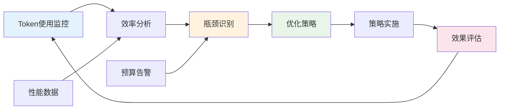

---
# YAML 前言区 | YAML Front-matter
meta:
  identifier: "integration:token-economy"
  title_zh: "Token经济性优化"
  title_en: "Token Economy Optimization"
  shortTitle_zh: "Token经济"
  shortTitle_en: "Token Economy"
  moduleType: ["集成", "integration"]
  domain: ["Token经济", "成本控制", "预算管理", "精益创业"]
  version: "1.0.0"
  status: ["已迁移", "生产就绪"]
  owner: "{{系统架构师}}"
  stakeholders: ["创始人", "产品经理", "技术负责人", "财务负责人"]
  tags: ["token-economy", "cost-control", "budget-management", "optimization"]
  created: "2025-08-07"
  updated: "2025-08-07"
  relates_to: [
    "../../shared/fields/fields-s3out/fields.yaml",
    "../01-LNST/LNST-Overview.md",
    "../02-HMNM/HMNM-Architecture.md",
    "../03-MAOS/MAOS-Architecture.md",
    "../04-GSTR/GSTR-Framework.md",
    "../05-MATB/MATB-Conversion.md",
    "../../CORE-LNST-NEW.md"
  ]

# 语言配置 | Language Configuration
language:
  primary: "zh-cn"
  secondary: "en-us"
  fallback: "en-us"
  auto_detect: true

# 字段池引用配置
field_pool_config:
  source_file: "../../shared/fields/fields-s3out/fields.yaml"
  reference_method: "external_import"
  auto_sync: true
  fallback_mode: "local_cache"

# 引用方式: {{dynamic_fields.字段名}}
dynamic_fields:
  $ref: "../../shared/fields/fields-s3out/fields.yaml#/dynamic_fields"
---

# Token经济性优化

## 概述

Token经济性优化是LNST精益创业统筹中枢的核心成本控制机制，通过精细化的Token预算管理和优化策略，确保创业项目在有限资源下实现最大价值产出。

## Token预算速查表

### HMNM神经文档 (5200T)
- BLUEPRINT: ≤1500T (架构设计)
- ROOT: ≤600T (战略指令)
- META: ≤500T (机器配置)
- QUICKLAUNCH: ≤800T (快速启动)
- README: ≤1000T (项目导航)
- CHEATSHEET: ≤500T (问题速查)
- WINSHEET: ≤300T (胜利记录)

### MAOS智能体编排 (15000T/轮)
- 编排智能体: 200T/次
- 发现智能体: 1500T/次
- 验证智能体: 2000T/次
- 开发智能体: 2500T/次
- 融资智能体: 2500T/次
- 监控智能体: 300T/次

### 创业阶段预算 (53000T/周期)
- 发现阶段: 8000T
- 验证阶段: 10000T
- 开发阶段: 12000T
- 发布阶段: 8000T
- 融资阶段: 15000T

## 神经流Token效率优化

### 三大神经流路径

| 神经流类型 | Token消耗 | 时间要求 | 成功指标 | 优化策略 |
|------------|-----------|----------|----------|----------|
| **体系设计流** | 500T | 6小时内 | 架构图完成 | 模板化决策树 |
| **战略执行流** | 600T | 24小时内 | MVP存活 | 缓存常用路径 |
| **反馈强化流** | 300T | 实时 | 问题解决率≥90% | 增量学习优化 |

### Token使用效率监控

```yaml
token_monitoring:
  efficiency_metrics:
    utilization_rate: "≥85%"
    waste_threshold: "≤15%"
    optimization_target: "45%成本节省"
    
  alert_rules:
    budget_warning: 0.8  # 80%使用率告警
    efficiency_warning: 0.85  # 效率低于85%告警
    
  optimization_strategies:
    template_reuse: "40%节省率"
    dynamic_loading: "50%节省率"
    semantic_compression: "30%节省率"
```

## 智能体协作Token成本

### 协作矩阵Token成本

| 主智能体 | 协作智能体 | 协作类型 | 数据流向 | 触发条件 | Token成本 |
|----------|------------|----------|----------|----------|----------|
| 编排智能体 | 所有智能体 | 指挥协调 | 双向 | 任务分配 | 200T |
| 发现智能体 | 验证智能体 | 数据传递 | 单向 | 问题验证完成 | 500T |
| 验证智能体 | 开发智能体 | 需求传递 | 单向 | MVP验证通过 | 600T |
| 开发智能体 | 监控智能体 | 状态同步 | 双向 | 系统部署 | 400T |
| 融资智能体 | 发现+验证智能体 | 内容获取 | 单向 | 融资材料需求 | 800T |
| 监控智能体 | 所有智能体 | 性能监控 | 单向接收 | 实时监控 | 300T |

## MATB转换Token预算

### 转换类型Token成本

| 转换类型 | 输入格式 | 输出格式 | Token预算 | 准确率要求 | 应用场景 |
|----------|----------|----------|-----------|------------|----------|
| **HTx→ATr** | 人类自然语言 | ASCII树形结构 | 400T | ≥95% | 需求分析、架构设计 |
| **ATr→MDT** | ASCII树形结构 | Markdown表格 | 300T | ≥98% | 文档生成、数据展示 |
| **HTx→MDT** | 人类自然语言 | Markdown表格 | 500T | ≥90% | 快速文档化 |
| **MDT-NQd** | Markdown表格 | N-Quads语义 | 600T | ≥95% | 智能体通信 |

## Token经济性优化策略

### 五层优化机制

| 优化层级 | 优化策略 | Token节省率 | 实现方式 | 创业价值 |
|----------|----------|-------------|----------|----------|
| **LNST层** | 阶段性加载 | 50% | 按创业阶段激活功能 | 资源聚焦 |
| **HMNM层** | 模板复用 | 40% | {{变量}}占位符系统 | 标准化效率 |
| **MAOS层** | 按需激活 | 60% | 智能体动态编排 | 协作效率 |
| **GSTR层** | 符号化压缩 | 30% | 四元体系符号映射 | 语义压缩 |
| **MATB层** | 格式复用 | 70% | 转换模板缓存 | 转换效率 |

### 实时优化机制



---