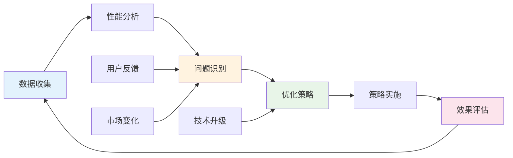

---
# YAML 前言区 | YAML Front-matter
meta:
  identifier: "implementation:deployment"
  title_zh: "部署实施指南"
  title_en: "Deployment Implementation Guide"
  shortTitle_zh: "部署指南"
  shortTitle_en: "Deployment Guide"
  moduleType: ["实施", "implementation"]
  domain: ["部署", "实施", "运维", "精益创业"]
  version: "1.0.0"
  status: ["已迁移", "生产就绪"]
  owner: "{{系统架构师}}"
  stakeholders: ["运维工程师", "技术负责人", "部署工程师"]
  tags: ["deployment", "implementation", "devops", "operations"]
  created: "2025-08-07"
  updated: "2025-08-07"
  relates_to: [
    "../../shared/fields/fields-s3out/fields.yaml",
    "../06-Integration/Integration-MVPFlow.md",
    "Implementation-BestPractices.md",
    "../../CORE-LNST-NEW.md"
  ]

# 语言配置 | Language Configuration
language:
  primary: "zh-cn"
  secondary: "en-us"
  fallback: "en-us"
  auto_detect: true

# 字段池引用配置
field_pool_config:
  source_file: "../../shared/fields/fields-s3out/fields.yaml"
  reference_method: "external_import"
  auto_sync: true
  fallback_mode: "local_cache"

# 引用方式: {{dynamic_fields.字段名}}
dynamic_fields:
  $ref: "../../shared/fields/fields-s3out/fields.yaml#/dynamic_fields"
---

# 部署实施指南

## 7 实施指南与监控

### 7.1 部署实施路径

#### 7.1.1 三阶段部署策略

```yaml
deployment_strategy:
  phase_1_foundation:
    duration: "1-2天"
    objectives: ["HMNM文档体系搭建", "MAOS智能体注册", "GSTR框架初始化"]
    deliverables: ["7份核心文档", "6类智能体", "四元体系配置"]
    success_criteria: "基础设施就绪度≥90%"
    
  phase_2_integration:
    duration: "2-3天"
    objectives: ["五层价值流集成", "Token优化配置", "MATB转换测试"]
    deliverables: ["集成配置", "优化策略", "转换引擎"]
    success_criteria: "集成测试通过率≥95%"
    
  phase_3_optimization:
    duration: "1-2天"
    objectives: ["性能调优", "监控配置", "投产准备"]
    deliverables: ["性能报告", "监控仪表板", "运维手册"]
    success_criteria: "生产就绪度≥98%"
```

#### 7.1.2 风险控制机制

| 风险类型 | 风险描述 | 概率 | 影响 | 控制措施 | 应急预案 |
|----------|----------|------|------|----------|----------|
| **Token超预算** | 成本控制失效 | 中 | 高 | 实时监控+自动限流 | 功能降级 |
| **智能体故障** | 协作中断 | 低 | 高 | 冗余备份+故障转移 | 手动接管 |
| **时间延期** | 24小时目标失败 | 中 | 中 | 关键路径监控 | 范围缩减 |
| **质量不达标** | 投资人就绪度不足 | 低 | 高 | 质量门禁+自动检测 | 人工审核 |
| **集成失败** | 系统无法协同 | 低 | 高 | 分层测试+渐进集成 | 回滚机制 |

### 7.2 监控与优化

#### 7.2.1 关键性能指标(KPI)

```yaml
kpi_monitoring:
  efficiency_metrics:
    mvp_delivery_time: "≤24小时"
    token_utilization_rate: "≥85%"
    automation_coverage: "≥90%"
    error_rate: "≤5%"
    
  quality_metrics:
    investor_readiness_score: "≥90%"
    technical_debt_ratio: "≤10%"
    user_satisfaction: "≥85%"
    system_reliability: "≥99%"
    
  business_metrics:
    startup_success_rate: "≥70%"
    time_to_market: "≤1个月"
    funding_success_rate: "≥60%"
    roi_improvement: "≥300%"
```

#### 7.2.2 持续优化机制



---