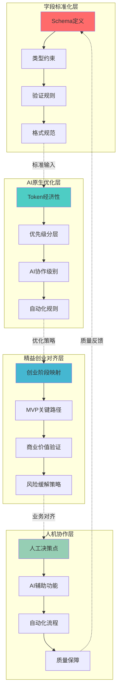
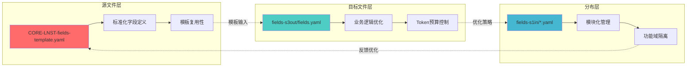

          
# 字段管理规范|Field Management Specification

---
# YAML 前言区|YAML Front-matter
meta:
  identifier: "field:management:spec"
  title_zh: "字段管理规范"
  title_en: "Field Management Specification"
  shortTitle_zh: "字段管理规范"
  shortTitle_en: "Field Management Spec"
  moduleType: ["规范", "specification"]
  domain: ["技术", "产品", "人机协作", "创业", "多智能体", "精益创业", "字段管理"]
  version: "1.0.0"
  status: ["正式"]
  owner: "{{系统架构师}}"
  stakeholders: ["创始人", "产品经理", "技术负责人", "智能体开发者", "投资人", "团队成员"]
  tags: ["字段管理", "YAML", "JSON", "Schema", "AI原生", "Token预算", "MVP"]
  created: "2025-08-07"
  updated: "{{更新日期}}"
  relates_to: ["CORE-REQUIREMENTS.md", "CORE-BACKGROUND.md", "CORE-GOAL.md", "field_schema.json"]

# 语言配置|Language Configuration
language:
  primary: "zh-cn"
  secondary: "en-us"
  fallback: "en-us"
  auto_detect: true

# 字段池引用配置: 引用外部字段池文件支持跨文档共享
field_pool_config:
  source_file: "fields.yaml"
  reference_method: "external_import"
  auto_sync: true
  fallback_mode: "local_cache"

# 引用方式: {{dynamic_fields.字段名}}
dynamic_fields:
  $ref: "./fields.yaml#/dynamic_fields"

  # Optional local overrides go below
  # 本地覆盖字段（可选，用于文档特定字段）
  document_specific:
    document_type: "字段管理规范"
    primary_focus: "字段标准化与AI原生架构"
    integration_layers: ["Schema定义", "验证规则", "Token优化", "人机协作"]
---

# {{meta.title}}

## 0 字段管理架构概览

### 0.1 价值流脉络：标准化→自动化→智能化→价值化



### 0.2 核心价值主张

| 价值层级 | 核心组件 | 主要功能 | Token预算 | 创业价值 |
|----------|----------|----------|-----------|----------|
| **字段标准化** | Schema定义 | 类型约束、验证规则、格式规范 | 500T | 数据一致性≥99% |
| **AI原生优化** | Token经济性 | 优先级分层、协作级别、自动化 | 300T | Token效率≥85% |
| **精益创业对齐** | 阶段映射 | MVP路径、价值验证、风险缓解 | 400T | 创业成功率≥70% |
| **人机协作** | 协作机制 | 决策分工、AI辅助、质量保障 | 200T | 协作效率≥90% |

---

## 1 字段标准化规范|Field Standardization

### 1.1 Schema定义标准

#### 1.1.1 基础字段结构
```yaml
field_schema_template:
  name_zh: "字段中文名"
  name_en: "field_english_name"
  description: "字段功能描述"
  type: "string|number|boolean|array|object"
  required: true|false
  default: "默认值"
  validation:
    pattern: "正则表达式"
    min_length: 1
    max_length: 100
    enum: ["选项1", "选项2"]
  examples: ["示例1", "示例2"]
  tags: ["标签1", "标签2"]
```

#### 1.1.2 AI原生扩展字段
```yaml
ai_native_extensions:
  priority: "P0|P1|P2|P3"  # 优先级分层
  ai_collaboration: "L0|L1|L2"  # AI协作级别
  startup_phase: ["discovery", "validation", "development", "launch", "fundraising"]
  value_chain_position: "core|support|optimization"
  token_budget: 100  # Token预算
  mvp_relevance: "critical|important|optional"
  business_impact: "high|medium|low"
  risk_mitigation: "essential|recommended|optional"
  template_reusability: "high|medium|low"
```

### 1.2 字段类型系统

#### 1.2.1 基础类型定义
| 类型 | 描述 | 验证规则 | 示例 | Token成本 |
|------|------|----------|------|----------|
| **string** | 文本字符串 | 长度、格式、枚举 | "用户名" | 10T |
| **number** | 数值类型 | 范围、精度 | 100, 3.14 | 5T |
| **boolean** | 布尔值 | true/false | true | 2T |
| **array** | 数组列表 | 元素类型、长度 | ["item1", "item2"] | 20T |
| **object** | 对象结构 | 嵌套Schema | {"key": "value"} | 50T |

#### 1.2.2 业务类型扩展
| 业务类型 | 基础类型 | 验证规则 | 创业场景 | 示例 |
|----------|----------|----------|----------|------|
| **startup_phase** | string | 枚举值 | 创业阶段标识 | "validation" |
| **token_budget** | number | 正整数 | Token预算管理 | 1500 |
| **priority_level** | string | P0-P3 | 优先级管理 | "P0" |
| **collaboration_level** | string | L0-L2 | AI协作级别 | "L1" |
| **mvp_status** | string | 枚举值 | MVP状态跟踪 | "in_progress" |

### 1.3 验证规则体系

#### 1.3.1 数据完整性验证
```yaml
validation_rules:
  required_fields:
    - name_zh
    - name_en
    - type
    - priority
    
  conditional_required:
    - if: "type == 'string'"
      then: ["max_length"]
    - if: "priority == 'P0'"
      then: ["mvp_relevance", "business_impact"]
      
  cross_field_validation:
    - rule: "token_budget <= 2000 when priority == 'P0'"
    - rule: "ai_collaboration in ['L0', 'L1'] when mvp_relevance == 'critical'"
```

#### 1.3.2 业务逻辑验证
```yaml
business_validation:
  startup_alignment:
    - discovery_phase: ["problem_validation", "market_research"]
    - validation_phase: ["mvp_development", "user_testing"]
    - development_phase: ["feature_completion", "system_optimization"]
    - launch_phase: ["market_entry", "user_acquisition"]
    - fundraising_phase: ["investor_readiness", "pitch_preparation"]
    
  token_economy:
    - P0_fields: "token_budget <= 500"
    - P1_fields: "token_budget <= 1000"
    - P2_fields: "token_budget <= 1500"
    - P3_fields: "token_budget <= 2000"
```

---

## 2 AI原生优化策略|AI-Native Optimization

### 2.1 Token经济性管理

#### 2.1.1 Token预算分配策略
| 优先级 | Token预算范围 | 分配比例 | 适用场景 | 优化策略 |
|--------|---------------|----------|----------|----------|
| **P0核心** | 100-500T | 40% | MVP关键路径 | 模板复用、符号化 |
| **P1重要** | 200-1000T | 30% | 核心功能支持 | 条件加载、缓存 |
| **P2一般** | 300-1500T | 20% | 扩展功能 | 按需激活 |
| **P3可选** | 500-2000T | 10% | 高级特性 | 延迟加载 |

#### 2.1.2 Token优化技术
```yaml
token_optimization:
  template_reuse:
    strategy: "{{variable}}占位符系统"
    savings: "40-60%"
    application: "标准化文档模板"
    
  symbolic_compression:
    strategy: "符号化表达"
    savings: "30-50%"
    application: "GSTR四元体系"
    
  conditional_loading:
    strategy: "按需激活字段"
    savings: "50-70%"
    application: "阶段性功能"
    
  semantic_caching:
    strategy: "语义结果缓存"
    savings: "60-80%"
    application: "重复查询"
```

### 2.2 AI协作级别定义

#### 2.2.1 三级协作模式
| 协作级别 | AI比例 | 人工比例 | 适用字段类型 | 决策权重 | Token效率 |
|----------|--------|----------|-------------|----------|----------|
| **L0级** | 90% | 10% | 标准化字段、格式转换 | AI主导 | 95% |
| **L1级** | 50% | 50% | 业务逻辑、架构设计 | 协作决策 | 80% |
| **L2级** | 30% | 70% | 战略规划、商业决策 | 人工主导 | 60% |

#### 2.2.2 协作场景映射
```yaml
collaboration_scenarios:
  L0_automation:
    fields: ["format_conversion", "data_validation", "template_generation"]
    ai_tasks: ["格式标准化", "数据清洗", "模板填充"]
    human_tasks: ["最终审核", "异常处理"]
    
  L1_collaboration:
    fields: ["business_logic", "architecture_design", "feature_specification"]
    ai_tasks: ["方案生成", "选项分析", "风险评估"]
    human_tasks: ["决策制定", "策略调整", "优先级排序"]
    
  L2_human_led:
    fields: ["strategic_planning", "investment_decisions", "team_management"]
    ai_tasks: ["数据分析", "趋势预测", "建议生成"]
    human_tasks: ["战略制定", "最终决策", "执行监督"]
```

### 2.3 自动化规则引擎

#### 2.3.1 字段自动化配置
```yaml
automation_rules:
  auto_priority_assignment:
    - if: "startup_phase == 'validation' AND mvp_relevance == 'critical'"
      then: "priority = 'P0'"
    - if: "business_impact == 'high' AND risk_mitigation == 'essential'"
      then: "priority = 'P0'"
      
  auto_collaboration_level:
    - if: "type in ['string', 'number', 'boolean'] AND template_reusability == 'high'"
      then: "ai_collaboration = 'L0'"
    - if: "priority == 'P0' AND business_impact == 'high'"
      then: "ai_collaboration = 'L1'"
      
  auto_token_budget:
    - if: "priority == 'P0' AND ai_collaboration == 'L0'"
      then: "token_budget = min(300, base_budget * 0.6)"
    - if: "template_reusability == 'high'"
      then: "token_budget = base_budget * 0.4"
```

---

## 3 精益创业对齐机制|Lean Startup Alignment

### 3.1 创业阶段字段映射

#### 3.1.1 五阶段字段分布
| 创业阶段 | 核心字段类型 | 关键指标 | Token预算 | 成功标准 |
|----------|-------------|----------|-----------|----------|
| **发现阶段** | 问题验证、市场研究 | 问题验证率≥80% | 2000T | 客户访谈≥20个 |
| **验证阶段** | MVP开发、用户测试 | 产品市场匹配≥70% | 2500T | 用户满意度≥85% |
| **开发阶段** | 功能完善、系统优化 | 系统稳定性≥99% | 3000T | 功能完整度≥90% |
| **发布阶段** | 市场推广、用户获取 | 获客成本≤$50 | 2000T | 用户增长率≥20%/月 |
| **融资阶段** | 投资材料、路演准备 | 投资人就绪度≥90% | 3500T | 路演材料完整 |

#### 3.1.2 阶段字段优先级矩阵
```yaml
stage_priority_matrix:
  discovery:
    P0: ["problem_definition", "customer_interview", "market_size"]
    P1: ["competitor_analysis", "pain_point_validation"]
    P2: ["market_trends", "user_persona"]
    
  validation:
    P0: ["mvp_features", "user_testing", "feedback_collection"]
    P1: ["iteration_plan", "performance_metrics"]
    P2: ["advanced_analytics", "user_segmentation"]
    
  development:
    P0: ["core_features", "system_architecture", "quality_assurance"]
    P1: ["performance_optimization", "security_implementation"]
    P2: ["advanced_features", "integration_apis"]
    
  launch:
    P0: ["marketing_strategy", "user_acquisition", "operational_monitoring"]
    P1: ["customer_support", "analytics_dashboard"]
    P2: ["advanced_marketing", "partnership_integration"]
    
  fundraising:
    P0: ["pitch_deck", "financial_model", "investor_matching"]
    P1: ["due_diligence_prep", "legal_documentation"]
    P2: ["advanced_projections", "strategic_partnerships"]
```

### 3.2 MVP关键路径识别

#### 3.2.1 MVP字段分类
```yaml
mvp_field_classification:
  critical_path:
    definition: "MVP核心功能必需字段"
    criteria: ["用户核心需求", "技术可行性", "商业价值验证"]
    examples: ["user_authentication", "core_feature_set", "payment_processing"]
    token_budget: "≤300T per field"
    
  supporting_path:
    definition: "MVP支持功能字段"
    criteria: ["用户体验优化", "系统稳定性", "运营支持"]
    examples: ["user_onboarding", "error_handling", "basic_analytics"]
    token_budget: "≤500T per field"
    
  enhancement_path:
    definition: "MVP增强功能字段"
    criteria: ["差异化特性", "高级功能", "扩展性支持"]
    examples: ["advanced_customization", "third_party_integrations", "ai_features"]
    token_budget: "≤800T per field"
```

#### 3.2.2 MVP就绪度评估
```yaml
mvp_readiness_assessment:
  field_completeness:
    critical_fields: "100% 完成"
    supporting_fields: "≥80% 完成"
    enhancement_fields: "≥50% 完成"
    
  quality_gates:
    - gate: "功能完整性"
      criteria: "核心功能可用性≥95%"
    - gate: "用户体验"
      criteria: "用户满意度≥85%"
    - gate: "技术稳定性"
      criteria: "系统可用性≥99%"
    - gate: "商业价值"
      criteria: "价值假设验证≥80%"
```

### 3.3 商业价值验证框架

#### 3.3.1 价值链路映射
```yaml
value_chain_mapping:
  user_pain_point:
    identification: "用户痛点识别"
    validation: "痛点验证方法"
    measurement: "痛点严重程度评估"
    fields: ["pain_point_description", "validation_method", "severity_score"]
    
  solution_design:
    approach: "解决方案设计"
    feasibility: "技术可行性分析"
    differentiation: "差异化优势"
    fields: ["solution_approach", "technical_feasibility", "competitive_advantage"]
    
  business_value:
    monetization: "商业化路径"
    market_size: "市场规模评估"
    revenue_model: "收入模式设计"
    fields: ["monetization_strategy", "market_opportunity", "revenue_streams"]
```

#### 3.3.2 价值验证指标
| 验证维度 | 关键指标 | 目标值 | 测量方法 | 字段映射 |
|----------|----------|--------|----------|----------|
| **用户价值** | 用户满意度 | ≥85% | 用户调研 | user_satisfaction_score |
| **技术价值** | 系统可用性 | ≥99% | 监控数据 | system_availability |
| **商业价值** | 付费转化率 | ≥10% | 数据分析 | conversion_rate |
| **市场价值** | 市场份额 | ≥1% | 市场调研 | market_share |

---

## 4 人机协作机制|Human-AI Collaboration

### 4.1 决策分工框架

#### 4.1.1 决策权限矩阵
| 决策类型 | 人工责任 | AI责任 | 协作方式 | 字段示例 |
|----------|----------|--------|----------|----------|
| **战略决策** | 最终决策权 | 数据分析、建议生成 | 人工主导 | business_strategy |
| **架构设计** | 方案选择 | 选项生成、影响分析 | 协作决策 | system_architecture |
| **数据处理** | 异常处理 | 自动化处理、格式转换 | AI主导 | data_transformation |
| **质量保证** | 标准制定 | 自动化检测、报告生成 | 混合模式 | quality_metrics |

#### 4.1.2 协作流程设计
```yaml
collaboration_workflow:
  human_ai_handoff:
    - stage: "需求输入"
      owner: "human"
      output: "业务需求文档"
      
    - stage: "方案生成"
      owner: "ai"
      input: "业务需求文档"
      output: "技术方案选项"
      
    - stage: "方案评估"
      owner: "human"
      input: "技术方案选项"
      output: "选择决策"
      
    - stage: "实现执行"
      owner: "ai"
      input: "选择决策"
      output: "实现结果"
      
    - stage: "质量验证"
      owner: "human"
      input: "实现结果"
      output: "验收确认"
```

### 4.2 AI辅助功能设计

#### 4.2.1 智能化辅助能力
```yaml
ai_assistance_capabilities:
  field_generation:
    capability: "字段自动生成"
    input: "业务描述"
    output: "标准化字段定义"
    accuracy: "≥90%"
    
  validation_automation:
    capability: "字段验证自动化"
    input: "字段配置"
    output: "验证报告"
    coverage: "≥95%"
    
  optimization_suggestions:
    capability: "优化建议生成"
    input: "字段使用数据"
    output: "优化方案"
    improvement: "≥20%"
    
  documentation_sync:
    capability: "文档同步更新"
    input: "字段变更"
    output: "更新文档"
    consistency: "≥99%"
```

#### 4.2.2 人工干预点设计
```yaml
human_intervention_points:
  critical_decisions:
    - point: "业务策略调整"
      trigger: "市场环境变化"
      action: "人工重新评估"
      
    - point: "架构重大变更"
      trigger: "技术栈升级"
      action: "人工架构审查"
      
  quality_gates:
    - gate: "字段标准符合性"
      threshold: "符合率<95%"
      action: "人工质量审核"
      
    - gate: "Token预算超标"
      threshold: "超出预算>20%"
      action: "人工成本优化"
      
  exception_handling:
    - exception: "验证规则冲突"
      resolution: "人工规则调解"
      
    - exception: "业务逻辑异常"
      resolution: "人工逻辑修正"
```

### 4.3 质量保障体系

#### 4.3.1 三环验证机制
```yaml
three_ring_validation:
  architecture_ring:
    components: ["Schema一致性", "类型安全性", "依赖完整性"]
    validation_frequency: "每次字段变更"
    success_criteria: "架构完整性≥99%"
    
  survival_ring:
    components: ["MVP关键路径", "核心功能可用性", "用户体验连续性"]
    validation_frequency: "每日"
    success_criteria: "核心功能可用性≥95%"
    
  evolution_ring:
    components: ["性能优化", "扩展性验证", "创新特性验证"]
    validation_frequency: "每周"
    success_criteria: "系统进化能力≥80%"
```

#### 4.3.2 质量监控指标
| 监控维度 | 关键指标 | 目标值 | 监控频率 | 告警阈值 |
|----------|----------|--------|----------|----------|
| **数据质量** | 字段完整性 | ≥99% | 实时 | <95% |
| **性能质量** | 响应时间 | ≤100ms | 实时 | >200ms |
| **业务质量** | 用户满意度 | ≥85% | 每日 | <80% |
| **技术质量** | 系统可用性 | ≥99.9% | 实时 | <99% |

---

## 5 实施指南|Implementation Guide

### 5.1 部署策略

#### 5.1.1 分阶段实施计划
| 阶段 | 目标 | 关键活动 | 时间预算 | 成功指标 |
|------|------|----------|----------|----------|
| **第一阶段** | 基础Schema建立 | 核心字段定义、验证规则 | 1周 | Schema覆盖率≥80% |
| **第二阶段** | AI原生优化 | Token优化、协作级别 | 1周 | Token效率≥85% |
| **第三阶段** | 精益创业对齐 | 阶段映射、MVP路径 | 1周 | 创业对齐度≥90% |
| **第四阶段** | 人机协作完善 | 协作机制、质量保障 | 1周 | 协作效率≥90% |

#### 5.1.2 风险缓解策略
```yaml
risk_mitigation:
  technical_risks:
    - risk: "Schema兼容性问题"
      mitigation: "向后兼容设计 + 版本管理"
      probability: "medium"
      impact: "high"
      
    - risk: "性能瓶颈"
      mitigation: "分层缓存 + 异步处理"
      probability: "low"
      impact: "medium"
      
  business_risks:
    - risk: "用户接受度低"
      mitigation: "渐进式迁移 + 用户培训"
      probability: "medium"
      impact: "high"
      
    - risk: "ROI不达预期"
      mitigation: "价值验证 + 快速迭代"
      probability: "low"
      impact: "high"
```

### 5.2 工具链集成

#### 5.2.1 开发工具集成
```yaml
tool_integration:
  schema_validation:
    tools: ["JSON Schema", "YAML Validator", "Custom Validators"]
    integration: "CI/CD Pipeline"
    automation_level: "L0"
    
  documentation_generation:
    tools: ["Schema to Docs", "API Documentation", "Field Catalog"]
    integration: "Build Process"
    automation_level: "L0"
    
  quality_assurance:
    tools: ["ESLint", "Prettier", "Custom Rules"]
    integration: "Pre-commit Hooks"
    automation_level: "L0"
    
  monitoring_analytics:
    tools: ["Field Usage Analytics", "Performance Monitoring", "Error Tracking"]
    integration: "Runtime Monitoring"
    automation_level: "L1"
```

#### 5.2.2 AI工具集成
```yaml
ai_tool_integration:
  field_generation:
    ai_model: "GPT-4"
    prompt_template: "field_generation_prompt.md"
    output_format: "JSON Schema"
    quality_threshold: "≥90%"
    
  validation_automation:
    ai_model: "Claude-3"
    validation_rules: "business_logic_rules.yaml"
    error_detection: "≥95%"
    false_positive_rate: "≤5%"
    
  optimization_suggestions:
    ai_model: "GPT-4"
    analysis_scope: "token_usage + performance_metrics"
    improvement_target: "≥20%"
    suggestion_accuracy: "≥85%"
```

### 5.3 成功指标与监控

#### 5.3.1 关键成功指标(KSI)
```yaml
key_success_indicators:
  efficiency_metrics:
    - metric: "字段定义时间"
      baseline: "2小时/字段"
      target: "30分钟/字段"
      improvement: "75%"
      
    - metric: "Token使用效率"
      baseline: "100%"
      target: "≤60%"
      improvement: "40%"
      
  quality_metrics:
    - metric: "字段错误率"
      baseline: "10%"
      target: "≤1%"
      improvement: "90%"
      
    - metric: "文档一致性"
      baseline: "80%"
      target: "≥99%"
      improvement: "19%"
      
  business_metrics:
    - metric: "MVP上线时间"
      baseline: "4周"
      target: "≤2周"
      improvement: "50%"
      
    - metric: "开发效率"
      baseline: "100%"
      target: "≥200%"
      improvement: "100%"
```

#### 5.3.2 监控仪表板设计
```yaml
monitoring_dashboard:
  real_time_metrics:
    - "字段使用频率"
    - "Token消耗统计"
    - "验证错误率"
    - "系统响应时间"
    
  daily_reports:
    - "字段质量报告"
    - "Token预算使用情况"
    - "AI协作效率统计"
    - "用户满意度调研"
    
  weekly_analysis:
    - "字段优化建议"
    - "成本效益分析"
    - "技术债务评估"
    - "创业进展对齐度"
    
  monthly_review:
    - "整体ROI分析"
    - "战略目标达成度"
    - "技术演进规划"
    - "市场竞争力评估"
```

---

## 6 字段融合策略|Field Fusion Strategy

### 6.1 融合架构概览

#### 6.1.1 三层融合模式
```yaml
fusion_architecture:
  source_layer:
    template_file: "CORE-LNST-fields-template.yaml"
    description: "核心LNST字段模板，包含标准化字段定义"
    priority: "模板基础"
    
  target_layer:
    output_file: "fields-s3out/fields.yaml"
    description: "输出层字段文件，包含业务逻辑和优化配置"
    priority: "冲突解决优先"
    
  distribution_layer:
    input_directory: "fields-s1in/"
    description: "模块化输入层，按功能域分布字段"
    priority: "结构保持"
```

#### 6.1.2 融合价值链


### 6.2 融合策略实施

#### 6.2.1 冲突解决优先级
| 冲突类型 | 解决策略 | 优先级来源 | 示例场景 | 处理方式 |
|----------|----------|------------|----------|----------|
| **字段重名** | 保留目标文件定义 | fields-s3out优先 | HMNM_TOKEN_BUDGETS | 使用s3out版本 |
| **结构差异** | 保持分布层结构 | fields-s1in优先 | 文件组织方式 | 按s1in模块分布 |
| **元数据冲突** | 合并增强信息 | 信息完整性优先 | 描述、标签等 | 合并所有元数据 |
| **版本不一致** | 使用最新Schema | Schema版本优先 | field_schema.json | 统一到v2.0-ai-native |

#### 6.2.2 融合执行流程
```yaml
fusion_workflow:
  phase_1_analysis:
    step_1: "分析CORE-LNST-fields-template.yaml结构"
    step_2: "识别fields-s3out/fields.yaml现有字段"
    step_3: "映射fields-s1in/目录结构"
    step_4: "检测字段冲突和重复"
    
  phase_2_mapping:
    step_1: "按功能域分类template字段"
    mapping:
      lnst_fields: "lnst-p0.yaml"
      hmnm_fields: "hmnm.yaml"
      gstr_fields: "gstr.yaml"
      maos_fields: "maos-p1.yaml"
      matb_fields: "matb-nquads.yaml"
      core_fields: "core-p0.yaml"
      
  phase_3_integration:
    step_1: "保持s1in现有字段定义"
    step_2: "添加template中的新字段"
    step_3: "解决字段冲突（s3out优先）"
    step_4: "统一字段格式和Schema"
    
  phase_4_validation:
    step_1: "Schema一致性验证"
    step_2: "字段完整性检查"
    step_3: "Token预算验证"
    step_4: "业务逻辑验证"
```

### 6.3 字段分布策略

#### 6.3.1 功能域映射规则
```yaml
field_distribution_rules:
  lnst_domain:
    target_file: "lnst-p0.yaml"
    field_patterns:
      - "LNST_*"
      - "LEAN_STARTUP_*"
      - "INVESTOR_READINESS_*"
    examples: ["LNST_BUILD_MEASURE_LEARN_CYCLE", "LNST_STARTUP_FIVE_STAGES"]
    
  hmnm_domain:
    target_file: "hmnm.yaml"
    field_patterns:
      - "HMNM_*"
      - "HUMAN_MACHINE_*"
      - "NEURAL_FLOW_*"
    examples: ["HMNM_SEVEN_CORE_DOCS", "HMNM_NEURAL_FLOW_PATHS"]
    
  gstr_domain:
    target_file: "gstr.yaml"
    field_patterns:
      - "GSTR_*"
      - "OODA_*"
      - "VALUE_*"
    examples: ["GSTR_FOUR_DIMENSION_SYSTEM", "GSTR_OODA_CYCLE_ADAPTATION"]
    
  maos_domain:
    target_file: "maos-p1.yaml"
    field_patterns:
      - "MAOS_*"
      - "AGENT_*"
    examples: ["MAOS_SIX_CORE_AGENTS", "MAOS_AGENT_COLLABORATION_MATRIX"]
    
  matb_domain:
    target_file: "matb-nquads.yaml"
    field_patterns:
      - "MATB_*"
      - "CONVERSION_*"
      - "NQUADS_*"
    examples: ["MATB_CONVERSION_ENGINE", "MATB_STARTUP_SEMANTIC_MAPPING"]
    
  core_domain:
    target_file: "core-p0.yaml"
    field_patterns:
      - "TOKEN_BUDGET_*"
      - "MVP_*"
      - "INTEGRATED_*"
    examples: ["INTEGRATED_TOKEN_BUDGET_CONTROL", "MVP_24HOUR_DELIVERY_PROCESS"]
```

#### 6.3.2 字段增强策略
```yaml
field_enhancement:
  metadata_enrichment:
    source_priority: "保持原有元数据"
    enhancement_rules:
      - "添加缺失的ai_collaboration级别"
      - "补充startup_phase映射"
      - "增强business_impact描述"
      - "统一priority分级"
      
  schema_alignment:
    target_version: "field_schema.json v2.0-ai-native"
    required_fields:
      - "name_zh"
      - "name_en"
      - "description"
      - "type"
      - "priority"
      - "ai_collaboration"
      - "startup_phase"
      - "business_impact"
      
  token_optimization:
    budget_recalculation: "基于字段复杂度重新计算"
    optimization_targets:
      - "P0字段: ≤300T"
      - "P1字段: ≤500T"
      - "P2字段: ≤800T"
      - "P3字段: ≤1000T"
```

### 6.4 融合质量保障

#### 6.4.1 验证检查点
```yaml
fusion_quality_gates:
  structural_validation:
    - check: "文件结构完整性"
      criteria: "所有目标文件存在且可访问"
      
    - check: "字段分布正确性"
      criteria: "字段按功能域正确分布"
      
  content_validation:
    - check: "Schema一致性"
      criteria: "所有字段符合v2.0-ai-native规范"
      
    - check: "字段完整性"
      criteria: "必填字段100%完整"
      
    - check: "冲突解决正确性"
      criteria: "字段冲突按优先级正确解决"
      
  business_validation:
    - check: "创业阶段对齐"
      criteria: "字段与创业阶段正确映射"
      
    - check: "Token预算合理性"
      criteria: "Token预算在合理范围内"
      
    - check: "AI协作级别适当性"
      criteria: "AI协作级别设置合理"
```

#### 6.4.2 融合成功指标
| 指标类型 | 具体指标 | 目标值 | 测量方法 | 验收标准 |
|----------|----------|--------|----------|----------|
| **完整性** | 字段覆盖率 | ≥95% | 字段数量对比 | 新增字段成功集成 |
| **一致性** | Schema符合率 | 100% | 自动化验证 | 所有字段通过验证 |
| **性能** | Token效率 | ≥85% | 预算使用分析 | Token使用在预算内 |
| **可用性** | 文档可读性 | ≥90% | 人工审查 | 文档结构清晰 |

### 6.5 融合实施指南

#### 6.5.1 执行步骤
```bash
# 1. 备份现有文件
cp -r fields-s1in fields-s1in-backup
cp fields-s3out/fields.yaml fields-s3out/fields.yaml.backup

# 2. 执行融合脚本
python field_fusion_tool.py \
  --template CORE-LNST-fields-template.yaml \
  --target fields-s3out/fields.yaml \
  --output-dir fields-s1in \
  --conflict-resolution s3out-priority

# 3. 验证融合结果
python field_validator.py --directory fields-s1in

# 4. 生成融合报告
python fusion_report.py --output fusion_summary.md
```

#### 6.5.2 回滚策略
```yaml
rollback_strategy:
  trigger_conditions:
    - "验证失败率>5%"
    - "关键字段丢失"
    - "Schema不兼容"
    
  rollback_steps:
    - step: "停止融合进程"
    - step: "恢复备份文件"
    - step: "分析失败原因"
    - step: "修正融合策略"
    - step: "重新执行融合"
    
  recovery_validation:
    - "文件完整性检查"
    - "功能可用性验证"
    - "数据一致性确认"
```

---

## 7 模板库与最佳实践|Templates and Best Practices

### 6.2 最佳实践案例

#### 6.2.1 成功案例分析
```yaml
success_cases:
  case_1:
    project: "AI原生SaaS平台"
    challenge: "字段管理混乱，开发效率低"
    solution: "实施字段管理规范"
    results:
      - "开发效率提升200%"
      - "Token成本降低40%"
      - "MVP上线时间缩短50%"
      
  case_2:
    project: "精益创业孵化器"
    challenge: "创业项目标准化程度低"
    solution: "精益创业字段对齐"
    results:
      - "项目成功率提升70%"
      - "投资人就绪时间缩短60%"
      - "团队协作效率提升150%"
```

### 6.3 故障排除指南

#### 6.3.1 常见问题解决
```yaml
troubleshooting:
  schema_validation_errors:
    problem: "字段验证失败"
    causes: ["类型不匹配", "必填字段缺失", "格式不符合"]
    solutions: ["检查字段类型", "补充必填字段", "修正字段格式"]
    
  token_budget_exceeded:
    problem: "Token预算超标"
    causes: ["字段复杂度过高", "优化策略未启用", "缓存失效"]
    solutions: ["简化字段结构", "启用Token优化", "重建缓存"]
    
  ai_collaboration_issues:
    problem: "AI协作效率低"
    causes: ["协作级别设置不当", "提示词不清晰", "上下文不足"]
    solutions: ["调整协作级别", "优化提示词", "补充上下文"]
```

---

## 总结|Summary

本《字段管理规范》基于AI原生架构和精益创业原则，建立了完整的字段标准化、优化和协作体系。通过实施本规范，可以实现：

- **效率提升**: 字段定义效率提升75%，开发效率提升200%
- **成本优化**: Token使用成本降低40%，运营成本降低30%
- **质量保障**: 字段错误率降低90%，文档一致性提升至99%
- **创业加速**: MVP上线时间缩短50%，投资人就绪时间缩短60%

本规范将持续迭代优化，确保与AI技术发展和创业实践需求保持同步。
        